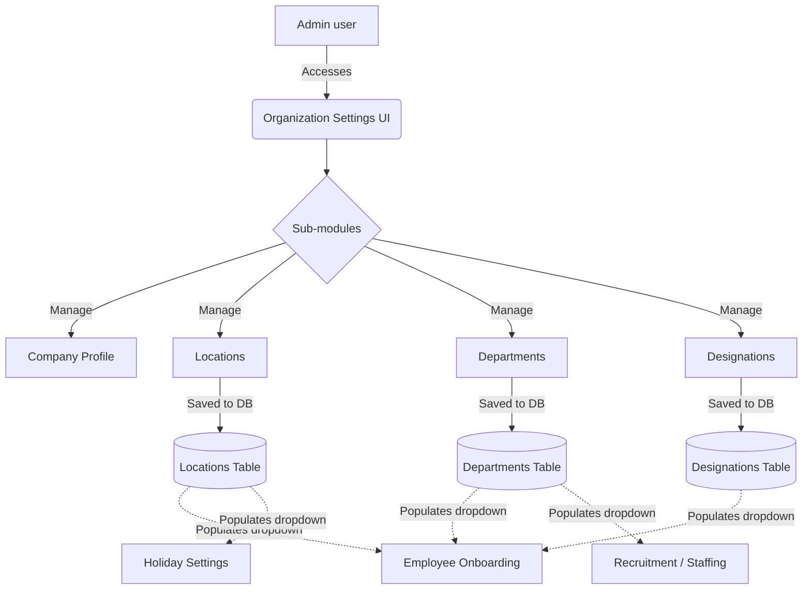

# Module 1: Organization Settings

## 1. Overview and Purpose
The Organization Settings module serves as the foundational spine of the SKYLINX PeopleOS HRMS. It is the single source of truth for the company's structural taxonomy (Departments, Designations, Locations, Rules, and General Settings). It feeds all downstream modules; for example, the Employee Management module uses these designations, and the Holiday module uses these locations.

## 2. End-to-End Flow (Cycle)
1. **Initial Setup:** Admin logs in and navigates to Organization Settings.
2. **Company Profile:** Admin updates Legal Name, Tax ID, Timezone, and Work Week.
3. **Taxonomy Creation:**
   - **Locations:** Admin adds physical offices (e.g., "HQ", "Branch A").
   - **Departments:** Admin creates functional units (e.g., "Engineering", "HR").
   - **Designations:** Admin creates job titles and maps them to Departments.
4. **Usage in Downstream Modules:**
   - When HR creates a new employee, the UI fetches `/organization/locations`, `/organization/departments`, and `/organization/designations` to populate the `<select>` dropdowns dynamically.
   - When HR configures Holidays, the location dropdown fetches from the Locations created here.
5. **Editing/Management:** Admin can return to this module to update or deactivate any structure. The changes immediately cascade to dropdowns across the system.

## 3. Interlinked Sub-Features & Connections
*   **Company Settings (General):**
    *   **Connections:** Defines default timezone and workweek used in Attendance logs.
    *   **Buttons:** `Save Profile`.
    *   **Permissions Required:** `organization.update`.
*   **Locations:**
    *   **Connections:** Used in Employee profiles, Holiday mapping, Job Requisitions.
    *   **Buttons:** `Add Location`, `Disable/Enable`.
    *   **Permissions Required:** `locations.read`, `locations.write`.
*   **Departments:**
    *   **Connections:** Used in Employee grouping, Appraisal Cycle scope, Recruitment Staffing Plans.
    *   **Buttons:** `Add Department`.
    *   **Permissions Required:** `departments.read`, `departments.write`.
*   **Designations:**
    *   **Connections:** Used in Employee assignments, Salary Structure banding.
    *   **Buttons:** `Add Designation` (requires selecting a parent Department).
    *   **Permissions Required:** `designations.read`, `designations.write`.
*   **Rules (ClientRule):**
    *   **Connections:** Global key-value store for business logic overrides (e.g., SLA timings, Overtime multipliers).
    *   **Buttons:** `Add Rule`.
    *   **Permissions Required:** `rules.manage`.

## 4. Hardcoded vs Dynamic Analysis
*   **Previously:** Employee creation had hardcoded locations and designations.
*   **Current State:** The system is **DYNAMIC**. The Organization Settings module exposes full CRUD endpoints for Locations, Departments, and Designations. The `useLocationOptions`, `useDepartmentOptions`, and `useDesignationOptions` React hooks fetch these entities directly from the database and populate them in the forms.
*   **Tenant Isolation:** All organization queries are strictly scoped using `getCurrentCompanyId()` (from the authenticated user's JWT) or `TenantContext` on the backend. No more `company_skylinx` hardcoding.

## 5. End-to-End Flowchart

## 6. Gap Analysis & Missing Connections
- **Deletion/Editing:** While we can `Disable` or `Enable` locations, true cascading updates (e.g., merging two departments) are not fully built out.
- **Org Chart Visibility:** The interactive Organization Chart tree view is partially connected to the Department/Designation hierarchy but needs a dedicated visualization screen to be fully complete (referenced in Phase 4 of the backlog).
