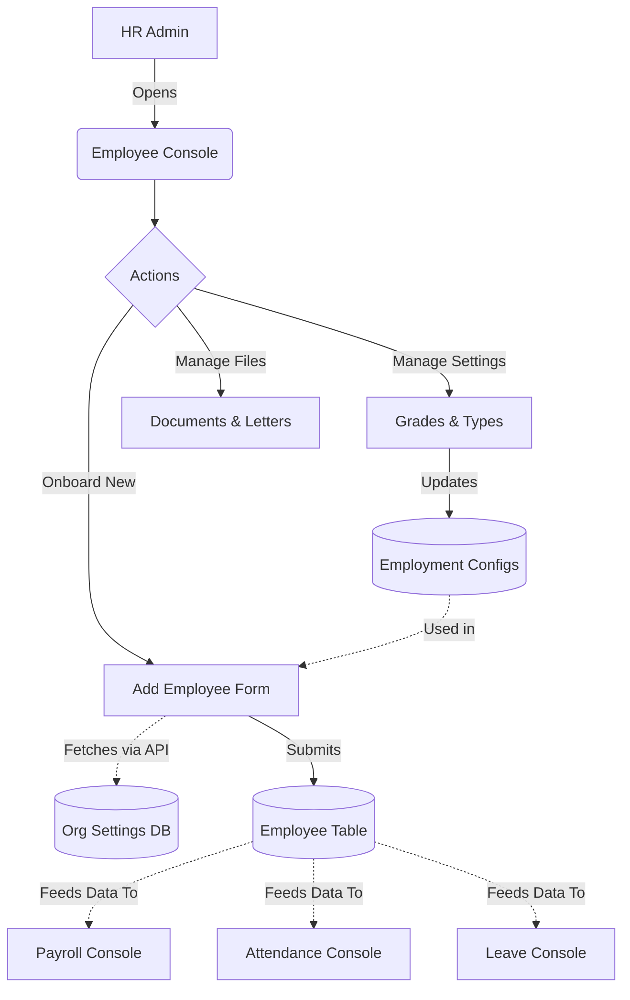

# Module 2: Employee Management

## 1. Overview and Purpose
The Employee Management module controls the core lifecycle and profile data for all staff within the organization. It manages onboarding, employee record updates, employment types, grades, documents, and eventually offboarding triggers.

## 2. End-to-End Flow (Cycle)
1. **Initial Setup:** HR admin accesses the Employee Console (`/employees`).
2. **Onboarding (Creation):** 
   - HR clicks "Add Employee" in the console.
   - The form fetches available Locations, Departments, Designations, Employment Types, and Grades dynamically from the backend APIs.
   - HR fills out the employee profile (First Name, Last Name, Code, Email) and selects the organizational mappings from the dynamic dropdowns.
   - The employee is created in the `Employee` database table with the `ACTIVE` status.
3. **Profile Management:**
   - The employee appears in the "EmployeesTable" listing.
   - HR can generate templates (e.g., Offer Letters) in the "Letter Templates" tab, mapping dynamic variables (like `[Employee Name]`) to the employee's record.
4. **Lifecycle & Documents:**
   - Important documents (ID proofs, contracts) can be uploaded against the employee ID.
   - Employment types and grades can be adjusted over time as the employee is promoted.

## 3. Interlinked Sub-Features & Connections
*   **Employee Creation / Onboarding:**
    *   **Connections:** Links tightly with Organization Settings (reads locations, departments, designations). Triggers Payroll setup (needs a Salary Structure).
    *   **Buttons:** `Add Employee`.
    *   **Permissions Required:** `employees.read`, `employees.write`.
*   **Employment Types & Grades:**
    *   **Connections:** Categorizes employees for different Leave Policies and Performance Appraisal templates.
    *   **Buttons:** `Add Type`, `Add Grade`.
    *   **Permissions Required:** `employees.settings`.
*   **Document Management:**
    *   **Connections:** Attaches physical/digital evidence to the employee profile.
    *   **Buttons:** `Upload Document`.
    *   **Permissions Required:** `employees.documents`.
*   **Letter Templates:**
    *   **Connections:** Generates PDFs/Docs dynamically.
    *   **Buttons:** `Create Template`.
    *   **Permissions Required:** `employees.letters`.

## 4. Hardcoded vs Dynamic Analysis
*   **Previously:** Employee Creation forms used static arrays for "Department", "Designation", and "Location". The API requests passed a hardcoded `companyId` (`company_skylinx`).
*   **Current State:** 
    *   The `companyId` is now securely fetched from the frontend JWT via `getCurrentCompanyId()`.
    *   The UI calls `/organization/locations`, `/employees/grades`, and `/employees/types` API endpoints upon mounting to fill the `<select>` drop-downs with actual database records. This resolves the user's issue: *"where is the option to add other locatino other designation how to edit or manage them"* - they are managed in the Org Settings and Employee Settings UI and feed directly into this module dynamically.

## 5. End-to-End Flowchart

## 6. Gap Analysis & Missing Connections
- **Employee Self-Service (ESS):** Employees cannot currently update their own addresses or emergency contacts; it requires HR intervention.
- **Offboarding Flow:** While an employee's status can be set to `EXITED`, a formalized offboarding wizard (clearing assets, triggering final F&F payroll) is disjointed and needs a unified interface.
