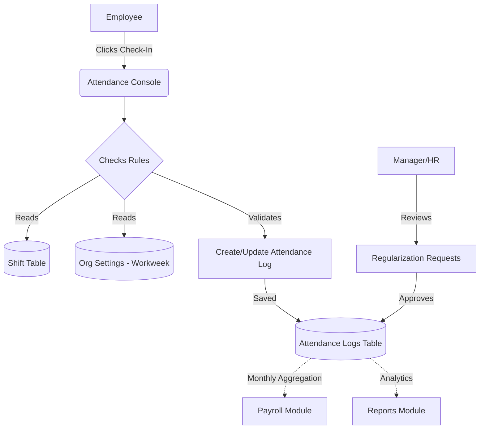

# Module 3: Attendance Management

## 1. Overview and Purpose
The Attendance Management module tracks employee presence, shifts, late check-ins, and absenteeism. It integrates closely with the Roster (shift scheduling) and calculates payable days for the Payroll module. It also ensures adherence to organizational policies like geofenced check-ins and overtime.

## 2. End-to-End Flow (Cycle)
1. **Initial Setup (Roster/Shifts):** HR or Department Managers create Shifts (e.g., "Morning Shift: 09:00 - 17:00") and assign them to employees in the Roster Console.
2. **Employee Check-In:**
   - Employee logs into the portal/app and clicks "Web Check-In" (or punches via biometric/geofenced mobile app).
   - The system records the `checkInAt` timestamp and marks the status (e.g., `PRESENT` or `LATE` based on shift start time).
3. **Employee Check-Out:**
   - Employee clicks "Web Check-Out" at the end of the day.
   - The system calculates total hours worked.
4. **Regularization (Exceptions):**
   - If an employee forgets to punch in, they can raise an Attendance Regularization request.
   - The Manager or HR reviews the request and approves/rejects it. If approved, the attendance log is updated.
5. **Payroll Processing:**
   - At month-end, the Payroll module pulls the total `PRESENT` and `PAID LEAVE` days from this module to compute the final salary.

## 3. Interlinked Sub-Features & Connections
*   **Web Check-In / Out:**
    *   **Connections:** Updates `AttendanceLog` table. Checks against current `Shift` times.
    *   **Buttons:** `Web Check-In`, `Check-Out`.
    *   **Permissions Required:** `attendance.self` (for employees), `attendance.manage` (for HR overrides).
*   **Shifts & Rosters:**
    *   **Connections:** Defines expected working hours. Links to specific employees or departments.
    *   **Buttons:** `Create Shift`, `Assign Shift`.
    *   **Permissions Required:** `shifts.manage`.
*   **Regularization Approvals:**
    *   **Connections:** Links to the global Approvals Inbox. Alters existing `AttendanceLog` records retroactively.
    *   **Buttons:** `Approve`, `Reject`.
    *   **Permissions Required:** `attendance.approve`.
*   **Reports:**
    *   **Connections:** The Custom Report Builder and `/reports/attendance` endpoint pulls these logs for HR analytics.

## 4. Hardcoded vs Dynamic Analysis
*   **Previously:** Test scenarios relied on hardcoded "Shift A" and basic 9-to-5 assumptions without dynamic DB-backed shift rules.
*   **Current State:** Shifts are fully dynamic, stored in the `Shift` model. Attendance logs map directly to an `employeeId` and `companyId` (derived dynamically from JWT/TenantContext). Workweek rules (e.g., "Monday to Saturday") are pulled from the Organization Settings module dynamically, preventing check-in errors on weekends unless explicitly scheduled.

## 5. End-to-End Flowchart

## 6. Gap Analysis & Missing Connections
- **Geofencing UI:** While the API can support latitude/longitude parameters, the Web UI currently lacks an interactive map or strict geofence blockage preventing check-ins outside the office perimeter.
- **Overtime Calculations:** Overtime is currently tracked as raw "extra hours" but lacks a dedicated automated approval pipeline before it hits the Payroll module as payable OT.
