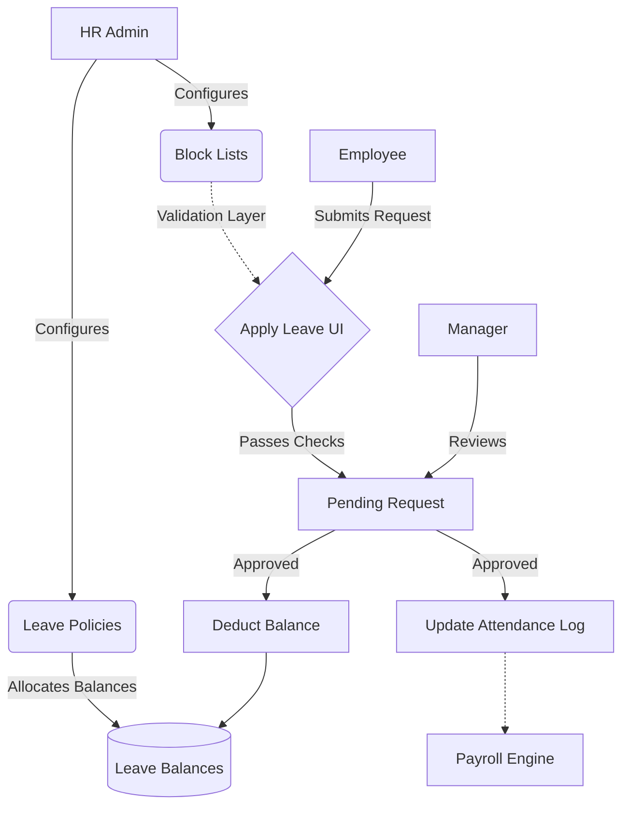

# Module 4: Leave Management

## 1. Overview and Purpose
The Leave Management module is responsible for defining leave policies (e.g., Annual, Sick, Maternity), allocating leave balances, enforcing blackout periods (Block Lists), and managing the end-to-end request and approval workflow.

## 2. End-to-End Flow (Cycle)
1. **Configuration (Admin/HR):**
   - HR creates a "Leave Policy" (e.g., "Standard 21 Days Paid Leave").
   - HR creates "Leave Block Lists" (e.g., "Q4 Blackout" where no leaves are allowed).
   - HR assigns the Leave Policy to specific Employees or Departments.
2. **Leave Request (Employee):**
   - Employee accesses the Leave Console and views their current allocated balances.
   - Employee clicks "Apply Leave", selects dates, leave type, and adds a reason.
   - The system checks if the requested dates conflict with any Block Lists or Holidays. If clear, the request is submitted.
3. **Approval Flow (Manager/HR):**
   - The request appears in the Approvals Inbox of the employee's reporting manager.
   - The manager clicks "Approve" or "Reject".
4. **Balance Deduction & Payroll Sync:**
   - Once Approved, the days are deducted from the employee's Leave Balance.
   - The approved leave days are mapped to the Attendance logs as "PAID LEAVE" (or "UNPAID") and feed directly into the Payroll calculations.

## 3. Interlinked Sub-Features & Connections
*   **Leave Policies & Allocation:**
    *   **Connections:** Maps directly to `Employee` records. Dictates maximum allowable days.
    *   **Buttons:** `Add Policy`, `Assign Policy`.
    *   **Permissions Required:** `leave.settings`.
*   **Leave Block Lists:**
    *   **Connections:** Validated during the leave application process. Blocks form submission for overlapping dates.
    *   **Buttons:** `Add Block List`, `+ Add Date`.
    *   **Permissions Required:** `leave.settings`.
*   **Leave Requests:**
    *   **Connections:** Links to `Approvals` and `AttendanceLog`.
    *   **Buttons:** `Apply Leave`, `Cancel Request`.
    *   **Permissions Required:** `leave.self` (Employee).
*   **Leave Approvals:**
    *   **Connections:** Deducts from `LeaveBalance` table.
    *   **Buttons:** `Approve`, `Reject`.
    *   **Permissions Required:** `leave.approve`.

## 4. Hardcoded vs Dynamic Analysis
*   **Previously:** `company_skylinx` was hardcoded in API endpoints fetching policies and blocklists in `leave-policy-panel.tsx`.
*   **Current State:** Fully dynamic. API fetch calls use ``/leave/policies/${getCurrentCompanyId()}`` and block lists fetch the same way. Leave assignments use a multi-select dropdown fed dynamically by the `/employees` endpoint.

## 5. End-to-End Flowchart

## 6. Gap Analysis & Missing Connections
- **Proration Logic:** While policies assign a flat number of days, automated mid-year proration (e.g., employee joins in July, gets half the balance) is not fully automated via the rules engine yet.
- **Multi-Level Approvals:** Currently, leaves route to a single approval tier. Complex routing (Manager -> HR -> Director for long leaves) requires expansion of the generic `Approvals` module.
