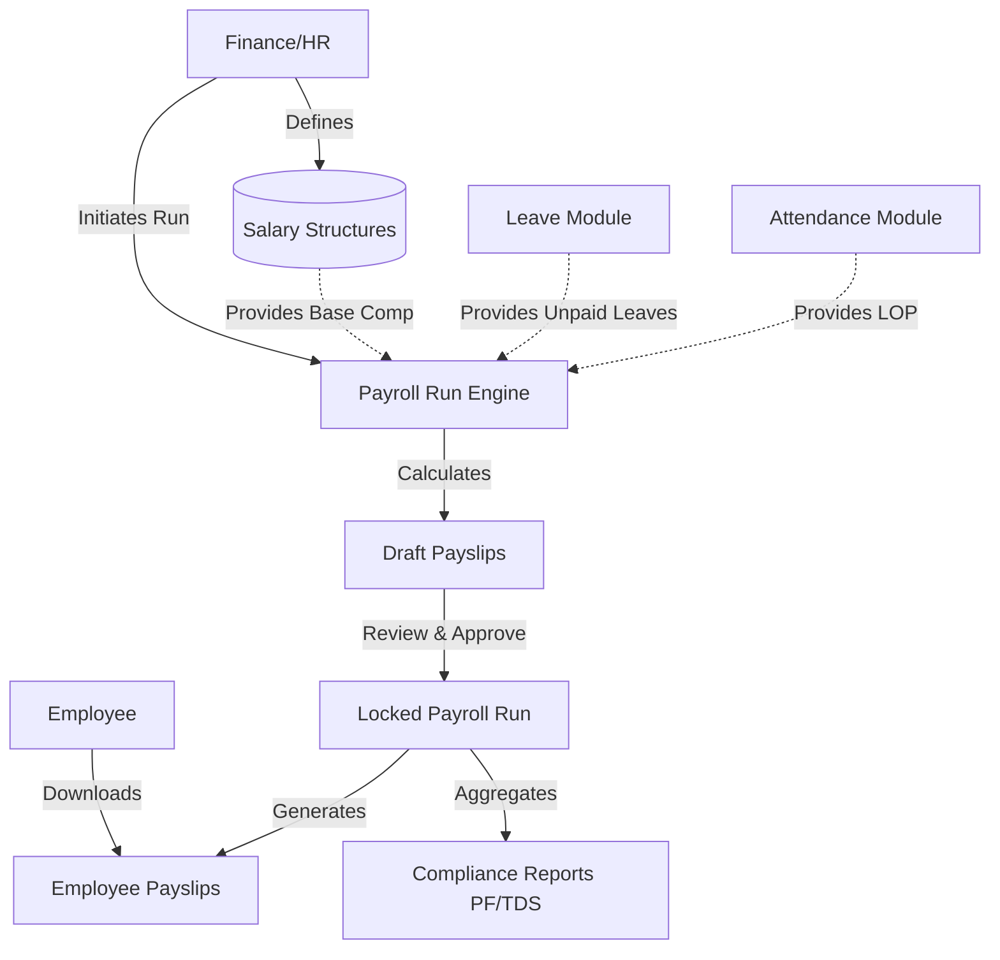

# Module 5: Payroll Management

## 1. Overview and Purpose
The Payroll Management module handles Salary Structures, Payroll Runs, Compliance Deductions (PF, ESI, TDS), and Payslip generation. It represents the financial culmination of the Attendance, Leave, and Employee Management modules.

## 2. End-to-End Flow (Cycle)
1. **Salary Structure Setup (HR/Finance):**
   - A Salary Structure is defined for an employee (Base Salary, HRA, Allowances, PF, TDS).
2. **Payroll Run Execution:**
   - At the end of the month, Finance initiates a new "Payroll Run" (e.g., June 2026).
   - The system calculates LOP (Loss of Pay) days by querying the `AttendanceLog` and `LeaveRequest` modules.
   - Gross pay is adjusted based on LOP. Deductions are subtracted to compute Net Pay.
3. **Approval & Lock:**
   - The generated Payslips remain in `DRAFT` status.
   - Finance reviews the anomalies and approves the Payroll Run. The run is locked.
4. **Payslip Distribution:**
   - Payslips are moved to `PAID` status.
   - Employees can view and download their PDF payslips via the Employee portal.

## 3. Interlinked Sub-Features & Connections
*   **Salary Structures:**
    *   **Connections:** Linked to `Employee` and `Designation` bands. Feeds the base calculations for the run.
    *   **Buttons:** `Edit Structure`.
    *   **Permissions Required:** `payroll.manage`.
*   **Payroll Runs:**
    *   **Connections:** Creates batch processes. Reads from `AttendanceLog` to calculate LOP.
    *   **Buttons:** `Run Payroll`, `Process Month`.
    *   **Permissions Required:** `payroll.run`.
*   **Payslips:**
    *   **Connections:** Generated artifacts. Linked to `Employee` and `PayrollRun`.
    *   **Buttons:** `View Details`, `Download PDF`.
    *   **Permissions Required:** `payroll.read` (Employee can only read their own).
*   **Compliance Dashboard:**
    *   **Connections:** Aggregates PF, ESI, and TDS from all processed payslips for statutory reporting.
    *   **Permissions Required:** `compliance.read`.

## 4. Hardcoded vs Dynamic Analysis
*   **Previously:** `company_skylinx` was hardcoded in the `Run Payroll` POST request inside `payroll-console.tsx` and in report aggregations.
*   **Current State:** The system dynamically isolates payroll runs to the authenticated user's tenant using `getCurrentCompanyId()`. Salary calculation logic is dynamic, though certain statutory percentages (like PF at 12%) are managed via `ClientRule` settings rather than hardcoded floats in the service.

## 5. End-to-End Flowchart

## 6. Gap Analysis & Missing Connections
- **Reimbursement Sync:** Expenses (reimbursements) are managed in a separate module but are not yet auto-injected into the monthly payslip as non-taxable additions.
- **Direct Bank Integration:** The system generates advice files but does not currently have direct API integrations with banks (e.g., payout via Stripe or corporate banking APIs).
