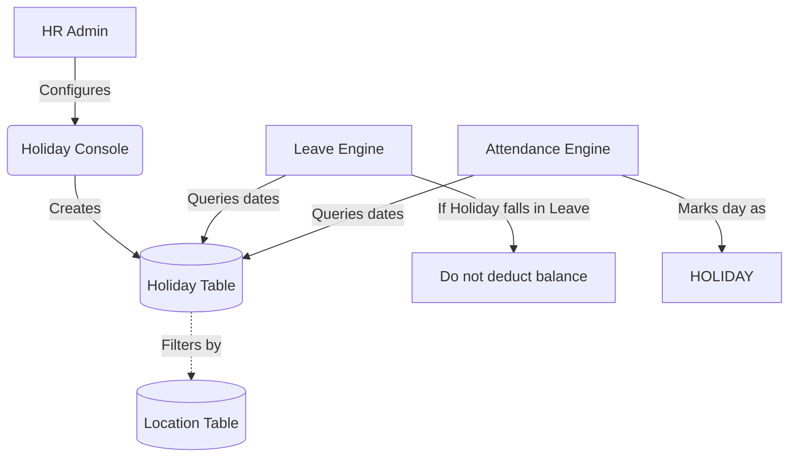

# Module 6: Holidays Management

## 1. Overview and Purpose
The Holidays Management module maintains the annual calendar of non-working days. It classifies holidays as Mandatory, Optional (Floating), or Regional, mapping them to specific company locations. It is a critical dependency for both Attendance and Leave calculations.

## 2. End-to-End Flow (Cycle)
1. **Calendar Setup:**
   - At the beginning of the year, HR navigates to the Holiday Console.
   - HR clicks "Add Holiday" and inputs the Name, Date, Type (Mandatory, Optional, Regional), and assigns an optional Location.
2. **System Propagation:**
   - The holiday is saved to the `Holiday` table.
   - The system automatically marks this date as a non-working day for the specified locations.
3. **Usage in Leaves:**
   - If an employee requests leave from Dec 24th to Dec 26th, and Dec 25th is marked as a Mandatory Holiday, the leave calculation engine automatically subtracts 1 day. The employee is only charged 2 days of leave balance.
4. **Usage in Attendance:**
   - The attendance engine expects no check-ins on holidays. If an employee does check in on a holiday, it can be flagged for "Holiday Pay" or "Compensatory Off" (depending on ClientRules).

## 3. Interlinked Sub-Features & Connections
*   **Holiday Creation / Management:**
    *   **Connections:** Links to `Location` (from Org Settings) and influences `LeaveRequest` and `AttendanceLog`.
    *   **Buttons:** `Add Holiday`, `Disable/Enable`.
    *   **Permissions Required:** `holidays.manage`.
*   **Regional/Optional Holidays:**
    *   **Connections:** Employees can opt-in to optional holidays via the Leave Request module (treated as a special leave type that doesn't deduct from their Annual balance).
    *   **Permissions Required:** `holidays.read`.

## 4. Hardcoded vs Dynamic Analysis
*   **Previously:** Holiday creation sent a hardcoded `companyId` and lacked a location dropdown. Alert stubs were used for location mapping.
*   **Current State:** 
    *   The `companyId` is derived dynamically from `getCurrentCompanyId()`.
    *   The Location dropdown fetches active locations dynamically via `useLocationOptions()`.
    *   The UI displays informative alert modals clarifying that rule integrations feed directly into the Attendance Engine automatically.

## 5. End-to-End Flowchart

## 6. Gap Analysis & Missing Connections
- **Compensatory Off Workflow:** If an employee works on a Mandatory Holiday, there is no automated trigger to add a +1 to their "Comp-Off" leave balance. This currently requires manual adjustment by HR.
