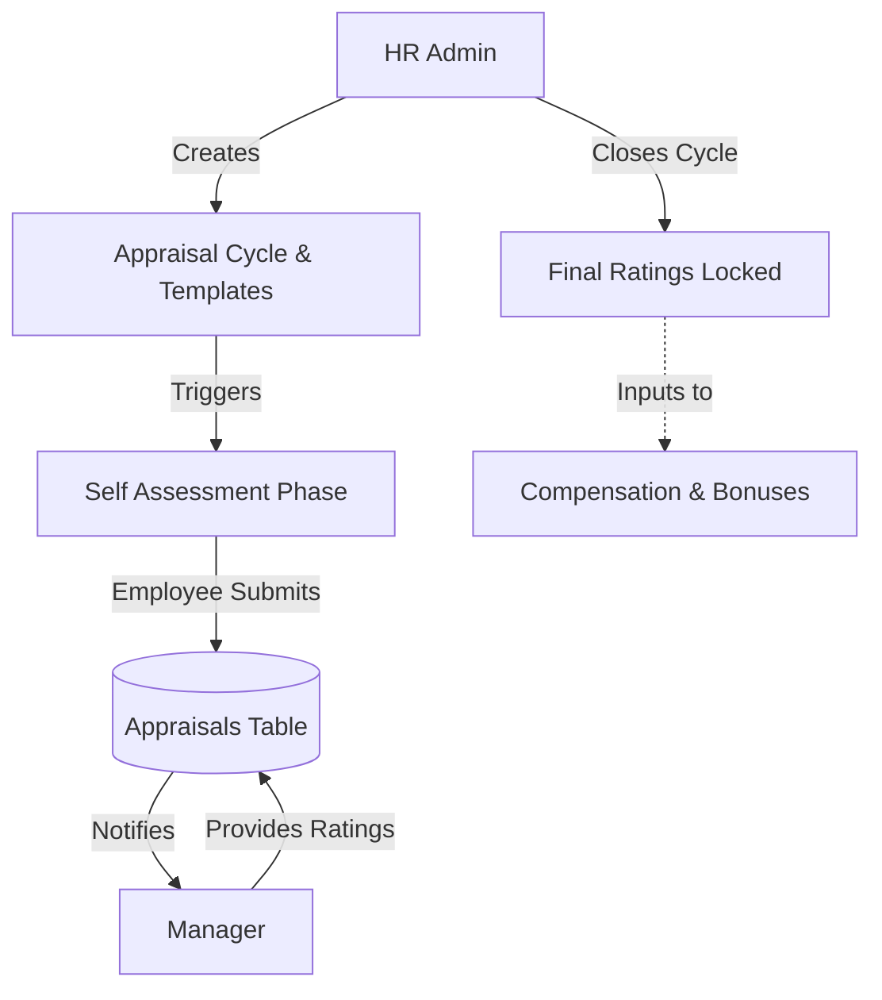

# Module 7: Performance Management

## 1. Overview and Purpose
The Performance Management module handles employee evaluations. It orchestrates Appraisal Cycles (e.g., "H1 2026 Review"), defines evaluation templates, triggers self-assessments, and routes reviews to managers.

## 2. End-to-End Flow (Cycle)
1. **Template & Cycle Creation (HR):**
   - HR creates an `AppraisalTemplate` (e.g., "Engineering L3 Review") with specific metrics (Technical, Behavioral).
   - HR initiates an `AppraisalCycle` (e.g., "Annual 2026"), setting start and end dates.
2. **Goal Setting (Employee/Manager):**
   - Employees define OKRs/Goals at the start of the cycle. Managers approve them.
3. **Self-Assessment (Employee):**
   - When the cycle enters the "Review" phase, the employee logs in, views their assigned template, and submits self-ratings and comments.
4. **Manager Assessment:**
   - The manager receives a notification. They review the employee's self-assessment and input their own ratings and final comments.
5. **Finalization (HR):**
   - The cycle is closed. Final ratings are locked and stored against the employee's profile.
   - These ratings feed directly into the Rewards/Compensation cycle for bonus calculations.

## 3. Interlinked Sub-Features & Connections
*   **Appraisal Cycles:**
    *   **Connections:** Batch processing. Links to `Department` and `AppraisalTemplate`.
    *   **Buttons:** `Create Cycle`.
    *   **Permissions Required:** `performance.manage`.
*   **Self & Manager Reviews:**
    *   **Connections:** Updates `Appraisal` records.
    *   **Buttons:** `Submit Self Review`, `Submit Manager Review`.
    *   **Permissions Required:** `performance.self` (Employee), `performance.review` (Manager).
*   **Goals & OKRs:**
    *   **Connections:** Continuous tracking outside of rigid cycles.
    *   **Buttons:** `Add Goal`.
    *   **Permissions Required:** `performance.self`.

## 4. Hardcoded vs Dynamic Analysis
*   **Current State:** 
    *   Performance metrics and scales (e.g., 1-5 rating scales) are dynamic, based on the `AppraisalTemplate` design.
    *   Tenant isolation is strictly enforced. Employees can only review subordinates mapped to them via the `managerId` field in the `Employee` model.

## 5. End-to-End Flowchart

## 6. Gap Analysis & Missing Connections
- **360-Degree Feedback:** The current architecture supports Employee -> Manager reviews, but lacks the complex multi-peer routing necessary for true 360-degree feedback (where 5+ peers review anonymously).
- **Continuous Feedback:** A formal system for logging "continuous feedback" (kudos, micro-reviews) throughout the year to surface during the annual appraisal is not yet built.
