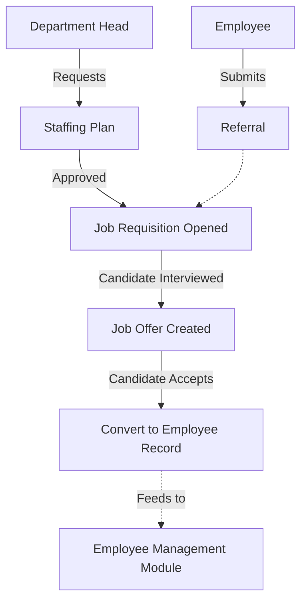

# Module 8: Recruitment Management

## 1. Overview and Purpose
The Recruitment Management module handles the acquisition of new talent. It manages Headcount/Staffing Plans, Job Requisitions, Job Offers, and internal Employee Referrals.

## 2. End-to-End Flow (Cycle)
1. **Staffing Plan (Finance/HR):**
   - Department heads submit headcount requests.
   - HR creates a `StaffingPlan` linking a `Department` and `Designation` with a `budgetedHeadcount`.
2. **Job Requisition:**
   - Based on approved staffing plans, a `JobRequisition` is opened.
   - The job is posted (internal/external).
3. **Referrals (Employees):**
   - Existing employees can view open requisitions in the "Referrals" tab and submit candidate details.
4. **Job Offers:**
   - Once a candidate clears interviews, HR generates a `JobOffer`.
   - The offer uses parameters (Salary, Grade) defined in Org Settings.
   - Upon candidate acceptance, the candidate data can be seamlessly converted into a new `Employee` record in the Employee Management module.

## 3. Interlinked Sub-Features & Connections
*   **Staffing Plans:**
    *   **Connections:** Links to `Department` and `Designation`.
    *   **Buttons:** `Add Staffing Plan`.
    *   **Permissions Required:** `recruitment.manage`.
*   **Job Offers:**
    *   **Connections:** Final step before Onboarding. Transitions external data to internal `Employee`.
    *   **Buttons:** `Create Offer`, `Change Status`.
    *   **Permissions Required:** `recruitment.manage`.
*   **Referrals:**
    *   **Connections:** Links `Employee` (referrer) to `JobRequisition`.
    *   **Buttons:** `Submit Referral`.
    *   **Permissions Required:** `recruitment.refer` (All employees).

## 4. Hardcoded vs Dynamic Analysis
*   **Previously:** `company_skylinx` was hardcoded in API endpoints fetching staffing plans and creating new plans in `recruitment-console.tsx`.
*   **Current State:** 
    *   The `companyId` is derived dynamically from `getCurrentCompanyId()`.
    *   The Staffing Plan creation form fetches `Departments` and `Designations` dynamically from the database rather than relying on static arrays, fixing the "where is the option to add other designation" issue raised by the user.

## 5. End-to-End Flowchart

## 6. Gap Analysis & Missing Connections
- **ATS (Applicant Tracking System):** While the module handles the *bookends* of recruitment (Staffing Plans and Job Offers), the middle pipeline (resume parsing, interview scheduling, scorecard feedback) is missing and requires a dedicated ATS expansion or third-party integration.
- **Referral Payouts:** If a referral is successful, there is no automated bridge to push the referral bonus into the `Payroll` module.
