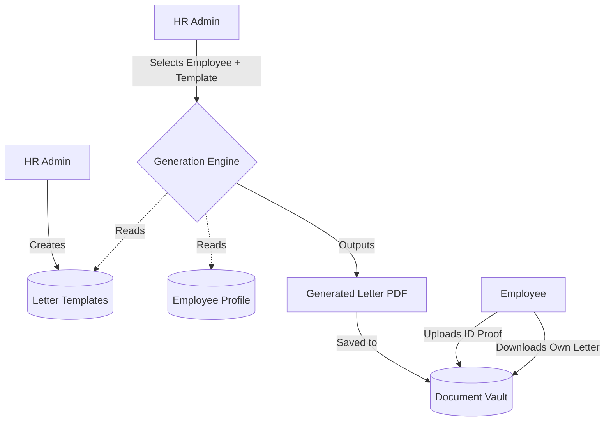

# Module 9: Documents & Letters Management

## 1. Overview and Purpose
This module handles the storage, generation, and distribution of official company documentation. This includes static document uploads (ID proofs, tax forms) and dynamic letter generation (Offer letters, Increment letters) using templates.

## 2. End-to-End Flow (Cycle)
1. **Template Creation (HR):**
   - HR navigates to the Letter Templates section (often embedded in the Employee Console).
   - HR creates a template using placeholders like `{{employeeName}}`, `{{designation}}`, `{{salary}}`.
2. **Document Generation:**
   - HR selects an employee and a template.
   - The system fetches the employee's data, replaces the placeholders, and generates a PDF/Word document.
3. **Static Uploads:**
   - Employees or HR can upload files directly to the `Document` repository attached to an `employeeId`.
   - Documents are categorized (e.g., "ID Proof", "Contract").
4. **Access Control:**
   - Employees can view and download their own documents.
   - Managers/HR can view documents based on permission scoping.

## 3. Interlinked Sub-Features & Connections
*   **Letter Templates:**
    *   **Connections:** Parses `Employee`, `Designation`, `SalaryStructure` data.
    *   **Buttons:** `Create Template`, `Generate Letter`.
    *   **Permissions Required:** `documents.manage`.
*   **Document Vault:**
    *   **Connections:** Uploads map directly to cloud storage (e.g., S3 via presigned URLs).
    *   **Buttons:** `Upload File`, `Download`.
    *   **Permissions Required:** `documents.read`, `documents.write`.

## 4. Hardcoded vs Dynamic Analysis
*   **Previously:** `company_skylinx` was hardcoded when fetching letter templates in the `employees-console.tsx`.
*   **Current State:** 
    *   The `companyId` is derived dynamically from `getCurrentCompanyId()`.
    *   Templates are saved to the database, ensuring that HR can create, edit, and delete templates without developer intervention.

## 5. End-to-End Flowchart

## 6. Gap Analysis & Missing Connections
- **E-Signatures:** The system generates documents but lacks an integrated e-signature workflow (like DocuSign) for legally binding contract execution directly within the portal.
- **Bulk Generation:** There is no UI flow to generate letters in bulk (e.g., generating 500 bonus letters at once based on a CSV upload or Appraisal cycle close).
