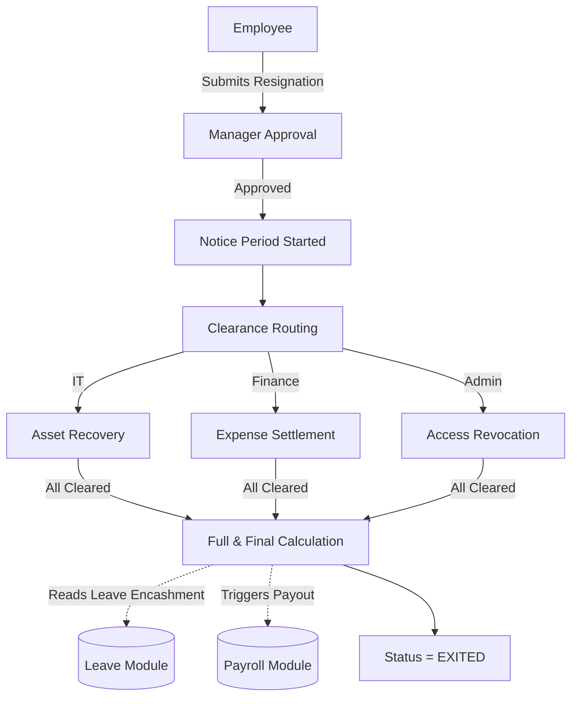

# Module 10: Offboarding & Lifecycle

## 1. Overview and Purpose
The Offboarding module manages the graceful exit of an employee from the organization. It coordinates resignation requests, notice period calculations, exit interviews, asset recovery, and the Full & Final (F&F) settlement.

## 2. End-to-End Flow (Cycle)
1. **Resignation Initiation:**
   - Employee submits a resignation request via the portal.
   - Alternatively, HR initiates a termination.
2. **Approval & Notice Period:**
   - Manager/HR approves the resignation.
   - The system calculates the `lastWorkingDay` based on the employee's `EmploymentType` notice period rules.
3. **Clearance Routing:**
   - Automated clearance requests are routed to specific departments:
     - IT: Recover laptop/assets.
     - Finance: Clear pending expenses.
     - Admin: Revoke access cards.
4. **Exit Interview:**
   - Employee completes an exit survey.
5. **Full & Final Settlement (F&F):**
   - The system aggregates pending salary, unavailed leave encashment, and deductions.
   - The final amount is pushed to the Payroll module for the final payout.
   - The employee's status changes from `ACTIVE` to `EXITED`.

## 3. Interlinked Sub-Features & Connections
*   **Resignation Workflows:**
    *   **Connections:** Links to `Approvals` and `EmploymentType` (for notice duration).
    *   **Buttons:** `Submit Resignation`, `Approve/Reject`.
    *   **Permissions Required:** `lifecycle.self` (Employee), `lifecycle.manage` (HR).
*   **Clearance Matrix:**
    *   **Connections:** Links to `Assets` and `Expenses` modules to verify no pending dues.
    *   **Buttons:** `Mark Cleared`.
    *   **Permissions Required:** `lifecycle.clearance`.
*   **F&F Calculation:**
    *   **Connections:** Integrates heavily with `LeaveBalance` (encashment) and `Payroll`.

## 4. Hardcoded vs Dynamic Analysis
*   **Current State:** 
    *   Lifecycle events (promotions, transfers, exits) are recorded dynamically in the `EmployeeLifecycle` or related tables.
    *   The `companyId` isolation ensures exit data doesn't cross tenant boundaries.

## 5. End-to-End Flowchart

## 6. Gap Analysis & Missing Connections
- **Clearance Dashboard:** The visual UI for the Clearance Matrix is fragmented. IT, Finance, and Admin need a unified "Offboarding Checklist" UI to clear employees efficiently.
- **Alumni Portal:** Once the status is `EXITED`, the user loses all login access. There is no "Alumni" view for former employees to download their final payslips and Form 16s.
