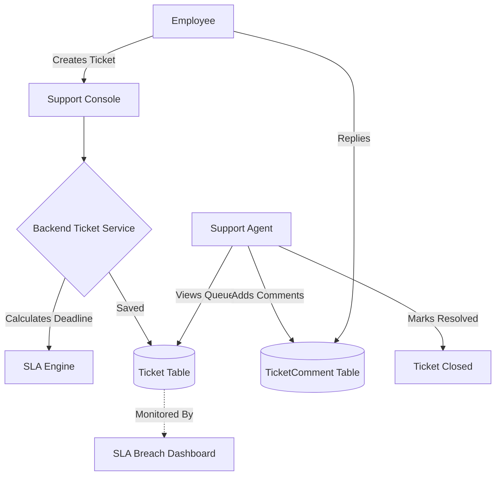

# Module 11: Support & Tickets (Helpdesk)

## 1. Overview and Purpose
The Support module acts as the central internal helpdesk for employees. Whether it's an IT request (broken laptop), an HR grievance (payroll dispute), or a facility request, this module tracks the lifecycle of the ticket from creation to resolution, strictly enforcing Service Level Agreements (SLAs).

## 2. End-to-End Flow (Cycle)
1. **Ticket Creation (Employee):**
   - Employee opens the Support Console and creates a new ticket.
   - They define the Subject, Description, Queue (IT, HR, Facilities), and Priority (Low, Medium, High).
2. **SLA Calculation:**
   - Upon creation, the backend `TicketsService` reads the Priority and automatically computes an `slaDeadline` (e.g., 24 hours for High, 48 hours for Medium).
3. **Ticket Assignment & Resolution (Agent):**
   - An HR or IT agent views the global queue.
   - They claim the ticket (`assignedTo`).
   - Agent and Employee converse via the `TicketComment` thread.
4. **Closure:**
   - Once resolved, the agent marks the ticket `Status = Closed`.
   - If the current time exceeds the `slaDeadline` before closure, the ticket is flagged as SLA Breached.

## 3. Interlinked Sub-Features & Connections
*   **Ticket Queues:**
    *   **Connections:** Routes tickets to different departments.
    *   **Buttons:** `Filter by Queue`.
    *   **Permissions Required:** `support.read` (self), `support.manage` (global queue access).
*   **Comments & Activity:**
    *   **Connections:** Appends chat history to the `TicketComment` table.
    *   **Buttons:** `Add Reply`.
    *   **Permissions Required:** `support.comment`.
*   **SLA Engine:**
    *   **Connections:** Automatically computes deadlines based on `Priority`. Feeds data to HR dashboard for SLA compliance metrics.

## 4. Hardcoded vs Dynamic Analysis
*   **Previously:** The schema lacked an SLA tracking mechanism.
*   **Current State:** 
    *   The `Ticket` model now includes `slaDeadline DateTime?`.
    *   The `TicketsService` dynamically calculates this deadline at the exact moment of ticket creation based on the priority submitted.
    *   All tickets are strictly bound to a `tenantId` (derived dynamically from the user's JWT) to prevent cross-company data leakage.

## 5. End-to-End Flowchart

## 6. Gap Analysis & Missing Connections
- **Email/Slack Integration:** Currently, tickets must be managed entirely within the web portal. Employees cannot create or reply to tickets via email or Slack.
- **Automated Escalation:** If an SLA breaches, there is no automated trigger to re-assign the ticket to a higher-level manager or send a warning email.
