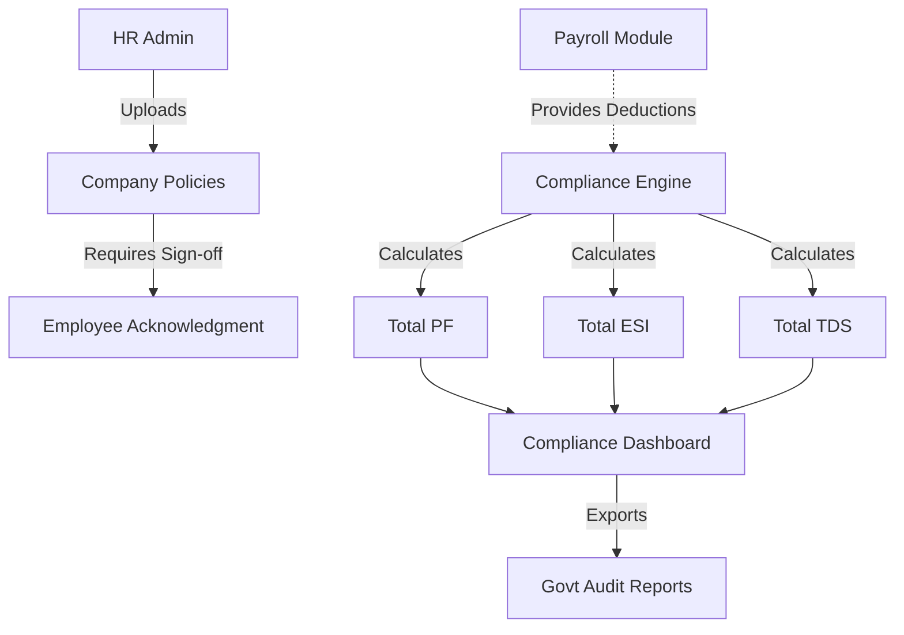

# Module 12: Compliance & Policies

## 1. Overview and Purpose
The Compliance module ensures the organization adheres to regional labor laws and internal corporate governance. It tracks statutory deductions (PF, ESI, TDS) and mandates employee acknowledgment of corporate policies (e.g., Code of Conduct, Anti-Harassment).

## 2. End-to-End Flow (Cycle)
1. **Policy Publication (HR/Legal):**
   - HR uploads a new policy document (e.g., "Remote Work Policy v2.pdf") in the Policies Console.
   - HR configures the policy to require mandatory acknowledgment from all employees.
2. **Employee Acknowledgment:**
   - The employee logs in and sees a blocking banner or notification requiring them to read and digitally sign/acknowledge the new policy.
   - The acknowledgment is recorded in the database with a timestamp.
3. **Statutory Compliance Tracking (Finance):**
   - The system aggregates data from the `Payroll` module.
   - Finance views the Compliance Dashboard to see total Provident Fund (PF), Employee State Insurance (ESI), and Tax Deducted at Source (TDS) collected across the entire company for a given month.
4. **Audit Readiness:**
   - The system generates reports containing the aggregated compliance metrics, ready for submission to government portals.

## 3. Interlinked Sub-Features & Connections
*   **Company Policies:**
    *   **Connections:** Links to `Documents` for storage. Links to `Employee` for acknowledgment tracking.
    *   **Buttons:** `Upload Policy`, `Require Acknowledgment`.
    *   **Permissions Required:** `policies.manage`.
*   **Compliance Dashboard:**
    *   **Connections:** Aggregates live data from `SalaryStructure` and `PayrollRun` tables.
    *   **Buttons:** `Export Compliance Report`.
    *   **Permissions Required:** `compliance.read`.

## 4. Hardcoded vs Dynamic Analysis
*   **Current State:** 
    *   The `Compliance Dashboard` relies entirely on dynamic calculations. Instead of storing a hardcoded "Total PF" value, the `ReportsService.complianceReport()` dynamically queries every `SalaryStructure` mapped to the current `tenantId` and sums the `employeePf`, `esi`, and `tds` fields on the fly.
    *   This ensures the dashboard is always 100% accurate relative to the live employee database.

## 5. End-to-End Flowchart

## 6. Gap Analysis & Missing Connections
- **Auto-Filing APIs:** The system aggregates the data perfectly but does not directly integrate with government tax portals (like the EPFO portal in India) for automated filing.
- **Compliance Alerts:** There are no proactive alerts to warn Finance if a mandatory payroll run has not been completed before the statutory deposit deadline (e.g., the 15th of the month).
