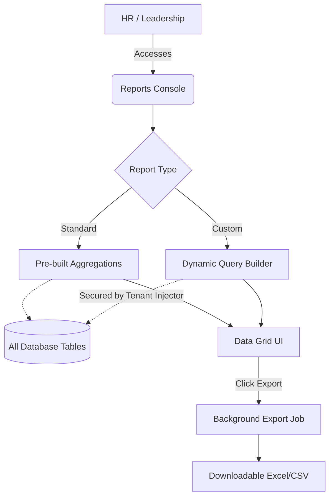

# Module 13: Reports & Analytics

## 1. Overview and Purpose
The Reports module acts as the analytical brain of the HRMS. It spans across every other module, pulling data from Attendance, Payroll, Leave, and Employee Management to provide actionable insights, exportable spreadsheets, and dynamic custom queries.

## 2. End-to-End Flow (Cycle)
1. **Pre-Built Reports:**
   - HR logs into the Reports Console.
   - They click on predefined categories: `Employees`, `Attendance`, `Leave`, `Payroll`, `Expenses`, or `Compliance`.
   - The backend `ReportsService` queries the respective database tables, aggregates the data, and returns a formatted JSON array for the data grid.
2. **Custom Report Builder:**
   - HR navigates to the "Custom Report Builder" tab.
   - They select a base Model (e.g., `ticket`, `employee`), define columns to `select`, and add `where` conditions.
   - The `POST /reports/custom` endpoint safely injects the `tenantId` into the `where` clause to prevent cross-tenant data leakage, runs the Prisma query, and returns the dynamic dataset.
3. **Data Export:**
   - The user clicks "Export CSV/XLSX".
   - A background job is queued in the `AuditLog` table, and the user can download the raw data file for Excel manipulation.

## 3. Interlinked Sub-Features & Connections
*   **Standard Reports:**
    *   **Connections:** Cross-queries `Employee`, `AttendanceLog`, `LeaveRequest`, `Payslip`, and `Expense` tables.
    *   **Buttons:** `View Report`.
    *   **Permissions Required:** `reports.read`.
*   **Custom Queries:**
    *   **Connections:** Directly interfaces with the Prisma ORM engine securely.
    *   **Buttons:** `Run Custom Query`.
    *   **Permissions Required:** `reports.read`.
*   **Export Engine:**
    *   **Connections:** Queues tasks for background workers to generate heavy files.
    *   **Buttons:** `Export`.
    *   **Permissions Required:** `reports.export`.

## 4. Hardcoded vs Dynamic Analysis
*   **Current State:** 
    *   The `Custom Report Builder` is the pinnacle of dynamic architecture in the system. It replaces hundreds of bespoke API endpoints with a single, highly flexible `POST /reports/custom` endpoint that accepts dynamic `select`, `where`, and `orderBy` parameters.
    *   **Security:** To prevent a tenant from querying another tenant's data via the custom builder, the backend automatically forces `queryWhere.companyId = tenantId` before executing the database query.

## 5. End-to-End Flowchart

## 6. Gap Analysis & Missing Connections
- **Data Visualizations:** While the system produces excellent tabular data, it lacks advanced, interactive charting (e.g., pie charts of diversity, line graphs of attendance trends) directly within the Reports Console. Analytics relies heavily on users exporting the data to Excel or BI tools.
- **Scheduled Reports:** There is no functionality for users to "Subscribe" to a report and receive it automatically in their inbox every Monday morning.
