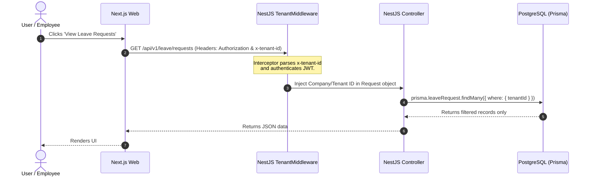
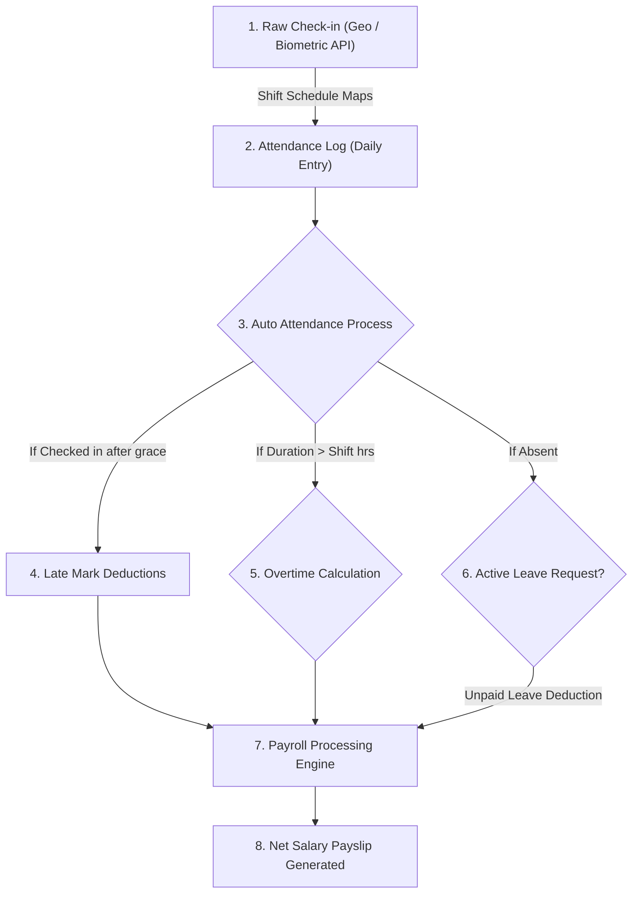

# System Architecture & Infrastructure Specification

This document details the macro-level architecture of the **SKYLINX PeopleOS HRMS** monorepo, outlining how the components interact, how multi-tenant isolation is enforced, and how backend data flows.

---

## 1. System Architecture Diagram

This diagram visualizes the multi-tier deployment, including Next.js SSR, NestJS API, PostgreSQL, Redis, and file storage.

```mermaid
graph TD
    UserBrowser["User Browser / Client"]
    NextJSApp["Next.js Web Frontend (Port 3000)"]
    NestJSApp["NestJS Core API (Port 4000)"]
    PostgreSQL["PostgreSQL Database"]
    Redis["Redis Cache & Queues (BullMQ)"]
    S3Storage["AWS S3 / DigitalOcean Spaces"]
    Nodemailer["SMTP / Nodemailer"]

    UserBrowser -->|HTTP / React UI| NextJSApp
    NextJSApp -->|API Requests / SSR Data| NestJSApp
    NestJSApp -->|Prisma Queries| PostgreSQL
    NestJSApp -->|Queue Jobs / Caching| Redis
    NestJSApp -->|File Uploads (Signed URLs)| S3Storage
    NestJSApp -->|Transporter Email| Nodemailer
```

---

## 2. Infrastructure Stack Specification

| Layer | Technology | Configuration Detail | Purpose |
| :--- | :--- | :--- | :--- |
| **API Backend** | NestJS (v10) | CommonJS, TypeScript compiler, Nest Router | Core business logic, dependency injection, and REST endpoints. |
| **Web Frontend** | Next.js (v15) | React 19, Tailwind CSS, Lucide icons, App Router | Server-Side Rendering (SSR), Client components, dashboard views. |
| **Database ORM** | Prisma Client (v5) | schema.prisma, PostgreSQL provider | Schema-first migrations, safe typing, database connection pooling. |
| **Authentication** | Passport & JWT | Access Token (15 mins), Refresh Token (7 days) | Secure token-based access, fine-grained Role Permissions. |
| **Notification Engine** | Nodemailer | SMTP Transporter + Queue | Emails payroll slip PDFs, onboarding tasks, and reminders. |
| **Task Queue** | BullMQ (Redis-backed) | Future implementation | Async background processing for payroll generation, email notifications. |

---

## 3. Multi-Tenant Isolation (SaaS Mode)

Security and strict segregation of tenant (company) data are enforced at the API layer. We use a **Tenant Middleware** interceptor that extracts the company/tenant context on every HTTP request.



---

## 4. Employee Lifecycle & Data Flow Interactions

This diagram illustrates how raw checkins from bio-devices or mobile geolocation flow through the system to compute attendance logs, overtime, leaves, and eventually construct the payroll slip.


