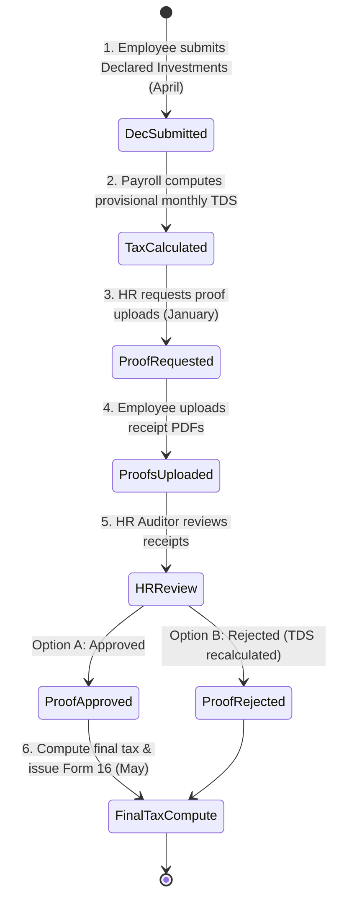

# Indian Statutory Compliance & Payroll Logic

This document specifies the mathematical formulas, regulatory thresholds, tax exemption rules, and processing flows required to configure the **Skylinx PeopleOS Payroll Engine** to comply with Indian labour laws, aligning with the regional rules in [hrms-16.8.0](file:///c:/Users/chbha/Desktop/skylinx/HRMS/hrms-16.8.0).

---

## 1. Employees Provident Fund (EPF)

EPF is governed by the Employees' Provident Funds and Miscellaneous Provisions Act, 1952.

### A. Statutory Slabs & Formula
* **Basic Wage Definition**: `Basic Salary + Dearness Allowance (DA)`.
* **Mandatory Threshold**: Employees with a basic wage of **₹15,000 per month** or less must contribute. If basic wage is greater than ₹15,000, contribution is optional or capped at ₹15,000 by default.
* **Employee Contribution**: **12%** of basic wages.
* **Employer Contribution**: **12%** of basic wages, subdivided as follows:
  * **Employees' Pension Scheme (EPS)**: **8.33%** (capped at a maximum of `8.33% * 15,000` = **₹1,250** per month).
  * **Employees' Provident Fund (EPF)**: Remaining balance (**3.67%** of basic wages, plus any excess over the EPS cap).

### B. Mathematical Implementation
$$\text{Wage Basis} = \min(\text{Basic} + \text{DA}, 15000) \quad \text{[If capped]}$$
$$\text{Employee PF Deduction} = \text{Wage Basis} \times 0.12$$
$$\text{Employer EPS Contribution} = \min(\text{Basic} + \text{DA}, 15000) \times 0.0833 \quad (\text{Max } 1250)$$
$$\text{Employer EPF Contribution} = (\text{Basic Wage} \times 0.12) - \text{Employer EPS Contribution}$$

---

## 2. Employees State Insurance (ESIC)

ESIC provides health and medical insurance for workers, governed by the ESI Act, 1948.

### A. Statutory Slabs & Formula
* **Eligibility Threshold**: Applicable to employees whose **Gross Monthly Salary** is **₹21,000 or less** (₹25,000 for employees with disabilities).
  * If an employee’s gross salary exceeds ₹21,000 after the start of a contribution period, contributions continue until the end of that contribution period (April–September or October–March).
* **Gross Salary Definition**: Basic + HRA + Allowances + Overtime + Bonuses.
* **Employee Contribution**: **0.75%** of Gross Salary.
* **Employer Contribution**: **3.25%** of Gross Salary.

### B. Mathematical Implementation
$$\text{If Gross Salary} \le 21000:$$
$$\text{Employee ESI Deduction} = \text{Gross Salary} \times 0.0075$$
$$\text{Employer ESI Contribution} = \text{Gross Salary} \times 0.0325$$

---

## 3. Professional Tax (PT)

PT is a state-level tax on professions and employment. Slabs are state-specific up to a maximum cap of **₹2,500 per year**.

### State Slabs (e.g. Maharashtra Example)
* **Monthly Gross Salary up to ₹7,500**: ₹0
* **Monthly Gross Salary ₹7,501 to ₹10,000**: ₹175 per month
* **Monthly Gross Salary above ₹10,000**: 
  * ₹200 per month for 11 months (April to January).
  * ₹300 for the month of February.

### State Slabs (e.g. Karnataka Example)
* **Monthly Gross Salary up to ₹24,999**: ₹0
* **Monthly Gross Salary above ₹25,000**: ₹200 per month (fixed).

---

## 4. Gratuity Calculation

Gratuity is a statutory payout for long-term service under the Payment of Gratuity Act, 1972.

### A. Rules
* **Eligibility**: Minimum of **5 years** of continuous service (which legally translates to 4 years and 240 days in cover).
* **Base Wage**: Last drawn `Basic Salary + DA`.

### B. Formula
$$\text{Gratuity Amount} = \frac{15 \times \text{Last Drawn Basic Wage} \times \text{Years of Service}}{26}$$
*Note: Service period is rounded off to the nearest year. For example, 5 years and 6 months = 6 years; 5 years and 5 months = 5 years.*

---

## 5. Income Tax Slabs (FY 2026-27 / AY 2027-28)

Employees can opt for the **Old Tax Regime** (with exemptions) or the **New Tax Regime** (default, lower rates but no deductions).

### A. New Tax Regime (Section 115BAC)
* Standard Deduction: **₹75,000** (updated per recent finance bills).
* Slabs:
  * Up to ₹3,00,000: **Nil (0%)**
  * ₹3,00,001 to ₹6,00,000: **5%**
  * ₹6,00,001 to ₹9,00,000: **10%**
  * ₹9,00,001 to ₹12,00,000: **15%**
  * ₹12,00,001 to ₹15,00,000: **20%**
  * Above ₹15,00,000: **30%**
* Tax rebate under Section 87A: Taxable income up to ₹7,00,000 pays zero tax (full rebate).

### B. Old Tax Regime (With Deductions)
* Standard Deduction: **₹50,000**
* Slabs:
  * Up to ₹2,50,000: **Nil (0%)**
  * ₹2,50,001 to ₹5,00,000: **5%**
  * ₹5,00,001 to ₹10,00,000: **20%**
  * Above ₹10,00,000: **30%**

---

## 6. Exemption Deductions under Old Tax Regime

If the employee elects the **Old Tax Regime**, the following deductions are calculated before computing taxable income:

### A. Section 80C (Maximum Deduction: ₹1,50,000)
Deductions include:
* Employee's contribution to Provident Fund (EPF).
* Public Provident Fund (PPF).
* Life Insurance Premiums (LIC).
* National Savings Certificates (NSC).
* Equity Linked Savings Schemes (ELSS Mutual Funds).
* Principal repayment on home loans.
* School tuition fees for up to 2 children.

### B. Section 80D (Medical Insurance)
* Premium paid for self, spouse, and children: Max **₹25,000** (₹50,000 if parents/spouse are senior citizens).

### C. House Rent Allowance (HRA) Exemption
Under Section 10(13A), HRA exemption is the **minimum** of the following three values:
1. Actual HRA received from employer.
2. Rent paid minus 10% of Basic Salary.
3. 50% of Basic Salary (if living in Metro: Delhi, Mumbai, Kolkata, Chennai) or 40% of Basic Salary (Non-Metro).

---

## 7. Tax Declaration & Proof Submission Workflow

---

## 8. Detailed Field Configurations & Setup Specifications

To fully support Indian compliance, the PostgreSQL database schemas and forms must be extended with the following metadata fields and configurations:

### A. Predefined Indian Salary Components (Seeding Data)
The system must be pre-seeded with these standard components:
1. **Basic** (Type: `Earning`, tax applicable): Base wage.
2. **House Rent Allowance** (Type: `Earning`, tax applicable): Eligible for HRA tax exemption.
3. **Arrear** (Type: `Earning`, tax applicable): Retroactive salary adjustments.
4. **Leave Encashment** (Type: `Earning`, tax applicable): Paid out for unused leaves.
5. **Provident Fund** (Type: `Deduction`, tax applicable): Employee's EPF share.
6. **Professional Tax** (Type: `Deduction`, exempted from income tax): State-level PT.

### B. Employee Directory Compliance Fields
The following fields must be added to the `Employee` model:
* `panNumber` (Text): Enforces standard Indian PAN format (`^[A-Z]{5}[0-9]{4}[A-Z]{1}$`).
* `providentFundAccount` (Text): Employee UAN / PF Account number.
* `ifscCode` (Text): IFSC code for bank transfers (dependent on bank payment mode).
* `micrCode` (Text): MICR bank identifier code.

### C. Company Payroll Master Settings
The `Company` profile must contain foreign keys linking default compliance components:
* `basicComponentId` -> Link to *Basic* Salary Component.
* `hraComponentId` -> Link to *House Rent Allowance* Salary Component.
* `arrearComponentId` -> Link to *Arrear* Salary Component.

### D. Tax Declaration & Proof Form Slabs
The tax declaration models must contain the following specific columns:
* **Declarations (`TaxExemptionDeclaration`)**:
  * `monthlyHouseRent` (Currency): Declared monthly rent.
  * `rentedInMetroCity` (Boolean Checkbox): True if living in Mumbai, Delhi, Bangalore, Kolkata, Chennai.
  * `salaryStructureHra` (Currency, Read-Only): Pulls current HRA from active salary structure.
  * `annualHraExemption` (Currency, Read-Only): Dynamically computed HRA tax exemption.
  * `monthlyHraExemption` (Currency, Read-Only): Dynamically computed monthly exemption.
* **Proofs (`TaxExemptionProofSubmission`)**:
  * `houseRentPaymentAmount` (Currency): Total rent paid for the year.
  * `rentedInMetroCity` (Boolean Checkbox): Verified metro check.
  * `rentedFromDate` (Date): Lease start date.
  * `rentedToDate` (Date): Lease end date.
  * `totalEligibleHraExemption` (Currency, Read-Only): Final verified HRA tax exemption amount.

### E. Gratuity Rule Configuration
The default gratuity rule must be seeded as:
* **Rule Name**: `Indian Standard Gratuity Rule`
* **Calculation Method**: `Current Slab`
* **Rounding Method**: `Round Off Work Experience` (rounds service years to nearest whole number, e.g. 5 yrs 6 mo = 6 yrs).
* **Minimum Service**: `5 Years`.
* **Multiplier Slab**: `15 / 26` (representing 15 days pay out of 26 working days in a month) times Basic + DA.

### F. Marginal Relief Parameters
* **Rule**: Under Section 87A, if taxable income exceeds ₹7,00,000 by a small margin, the tax liability cannot exceed the income earned above ₹7,00,000.
* **Database Parameter**: `marginalReliefLimit` (Currency) - represents the threshold under which tax relief rebates are computed.

