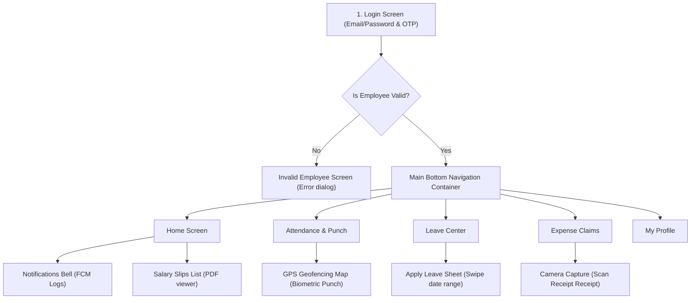

# SKYLINX PeopleOS: Master Project Roadmap & Flutter Mobile Specification

This document presents a detailed audit of completed versus remaining components across the Skylinx HRMS monorepo, followed by the architectural and user-interface specification for the **Flutter Mobile Application** (to be executed in the next stage of the product lifecycle).

---

## 1. Project Status Dashboard: Finished vs. Left

Based on our static analysis of the Prisma schema, NestJS controller routing, and Next.js frontend pages, here is the completion matrix:

```mermaid
gantt
    title SKYLINX HRMS Development Progress
    dateFormat  X
    axisFormat %d
    
    section Database Schema (Prisma)
    Core Directory & Identity (100% Done) :active, 0, 100
    Recruitment Models (0% Done)           :todo, 100, 150
    Onboarding & Exit Models (0% Done)      :todo, 150, 200
    Shift Roster Models (0% Done)           :todo, 200, 250
    Tax Compliance Slabs (0% Done)          :todo, 250, 300
    
    section Backend REST API (NestJS)
    Auth, Holidays, Expenses (70% Done)     :active, 0, 70
    Recruitment Endpoints (0% Done)         :todo, 70, 120
    Shift Scheduling Engine (0% Done)       :todo, 120, 170
    Indian Tax & PF Calculator (0% Done)    :todo, 170, 220
    Jest Test Suites Setup (0% Done)        :todo, 220, 260
    
    section Web Frontend (Next.js)
    Basic Page Routing (100% Done)          :active, 0, 100
    UI Page Components & Shells (40% Done)  :active, 100, 140
    Kanban Board & Roster UI (0% Done)      :todo, 140, 200
    Tax Declaration Portal (0% Done)        :todo, 200, 250
    Playwright E2E Setup (0% Done)          :todo, 250, 290
```



---

## 2. Granular Module Completion Audit

### A. Authentication & Access Control
* **Completed (90%)**: Login/Signup APIs, JWT authentication strategy, Role-Based Access Control (RBAC) decorator, Tenant Middleware, forgot password pages.
* **Remaining (10%)**: Two-Factor Authentication (2FA) enforcement controls and token revocation.

### B. Employee Directory
* **Completed (60%)**: Basic Employee CRUD, bank details, and document upload models.
* **Remaining (40%)**: Identification document type config tables, exit state triggers, timeline logs, and age/retirement auto-calculations.

### C. Attendance & Shift Roster
* **Completed (30%)**: Shift type model, raw checkin log schema, regularization request controller, and daily logs tables.
* **Remaining (70%)**: Shift schedules, Roster assignment calendars, shift swap requests, biometric raw file uploader, and auto-attendance daily scheduler processes.

### D. Leave Management
* **Completed (50%)**: Leave application, type, and balance models. Basic request/approval APIs.
* **Remaining (50%)**: Leave period adjustments, carry-forward scheduler scripts, sandwich rule checker logic, and compensatory leave (comp-off) linking.

### E. Payroll & Indian Statutory Compliance
* **Completed (20%)**: Standard salary structure and basic monthly payslip generation.
* **Remaining (80%)**: Custom Salary Component formula evaluator, flexible benefit allocations/claims, Indian tax exemption declaration inputs, tax proof verification drawers, income tax slab tables (Old vs. New regimes), PF/ESIC calculators, and bank transfer CSV exports.

### F. Recruitment ATS (Applicant Tracking)
* **Completed (10%)**: Basic prisma schemas for job posting, candidate, application, and interview.
* **Remaining (90%)**: NestJS recruitment module controllers/services, candidate stage transition APIs, interviewer scorecards, job offer contracts, and Next.js Kanban UI.

### G. Employee Training & Skill Matrices
* **Completed (0%)**: No database structures or API endpoints exist.
* **Remaining (100%)**: Training program outlines, student feedback collections, pass/fail result logs, designation-specific expected skill maps, and employee skill assessment scorecards.

---

## 3. Flutter Mobile Application Specification (Stage 2)

As decided, the mobile app will be built in **Flutter** using **Dart** to target both iOS and Android natively. 

### A. Technical Stack Architecture
* **State Management**: **Flutter BLoC (Business Logic Component)** or **Provider** for clean, reactive separation of UI and business logic.
* **Networking**: **Dio** with **Retrofit** for declarative REST API queries, caching headers, and file upload progress interceptors.
* **Local Storage**: **Flutter Secure Storage** (AES-encrypted keychain access) to cache auth JWTs.
* **Notifications**: **Firebase Cloud Messaging (FCM)** for real-time push alerts (leaves, salary release, shift reminders).
* **Location Engine**: **Geolocator** package for GPS tracking during checkin.

### B. Core Screen & Navigation Flow
The mobile app uses a Bottom Navigation Bar structure:



---

## 4. Flutter UI/UX Layouts, Scrollbars & Interaction Details

### A. Home Dashboard
* **Layout**: Circular greeting banner (employee avatar + status badge). Quick metrics grid: Leave balances, today's shift timing, remaining hours.
* **Interactions**: 
  * Tap on the avatar to pull out the profile drawer.
  * Tap on the notification icon to reveal an overlay sheet.

### B. Attendance Geofenced Punch
* **Layout**: Full-screen geofenced map. Displays current location pin and a green shaded radius representing the company premises.
* **Form Inputs**: 
  * Dropdown selector for *Current Shift*.
  * Text input for *Remarks/Location Note* (if checking in outside office).
* **Action Button**: Circular **"Punch In" (Blue Gradient)**.
  * **Gesture**: Swipe-up to punch in. Prevents accidental double-taps. Triggers Haptic Feedback on successful API response.

### C. Leave Center Sheet
* **Layout**: Quota circles at the top. Timeline showing past applications.
* **Action Trigger**: Floating Action Button (FAB) **"+"** opens a full-screen bottom-sheet modal.
  * **Sheet Modals Fields**:
    * Tap-to-select *Leave Type*.
    * Calendar picker with date-range sliding swipe.
    * Toggle switch for *Half Day*. If toggled, shows date picker for target day.
  * **Gesture**: Drag-down to dismiss draft request.

### D. Expense Claim Camera Upload
* **Layout**: Simple amount input field followed by category selectors.
* **Receipt Capture**: Clickable **"Capture Receipt"** camera container.
  * **Interactions**: Launches native phone camera. Returns cropped receipt image thumbnail. Shows loading spinner during upload.

### E. Scrollbar & Scrolling Rules
* **Scroll Controllers**: Scrollable columns use elastic bouncing scrolling physics (`BouncingScrollPhysics`) matching native iOS/Android behaviors.
* **Pull-to-Refresh**: Swipe down on lists (expenses, leaves, notifications) to reload resources from NestJS APIs.

---

## 5. Phased Mobile Integration Timeline

```
[Month 1: Foundation]
  - Configure Flutter SDK and directory structure.
  - Setup Dio HTTP interceptors and Secure Storage.
  - Implement login flows and JWT refresh loops.

[Month 2: Attendance & Leave]
  - Integrate Geolocation GPS verification APIs.
  - Create the geofenced map screen and Punch logic.
  - Build the leave application form and list.

[Month 3: Expense, Payroll & Push]
  - Integrate Camera capture for receipt attachment uploads.
  - Build Payslip list and offline PDF downloads.
  - Wire up Firebase Cloud Messaging (FCM) handlers.
```
