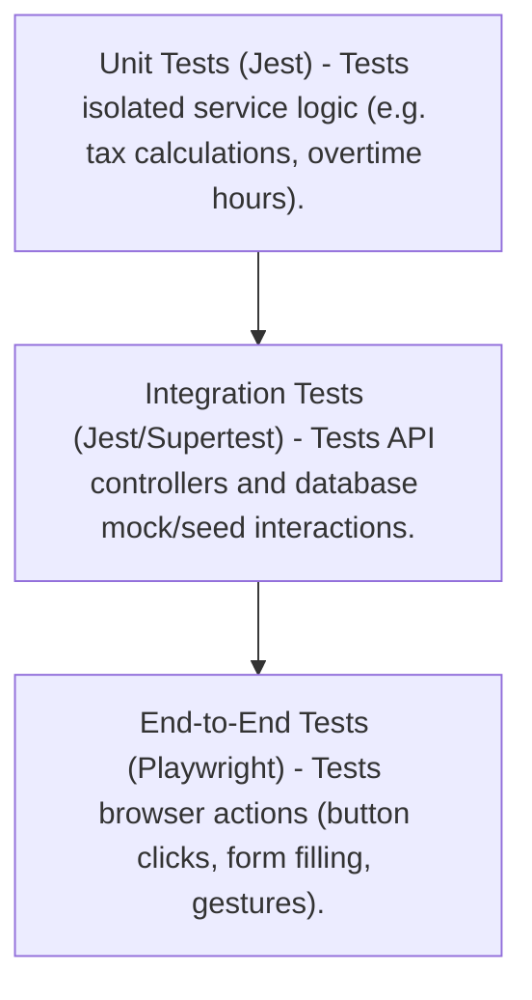

# Testing Strategy & Pipelines Specification

This document details the testing architecture, framework configurations, and test suites required for the **SKYLINX PeopleOS HRMS** monorepo, covering both the NestJS API ([apps/api](file:///c:/Users/chbha/Desktop/skylinx/HRMS/Hrms/apps/api)) and Next.js Web App ([apps/web](file:///c:/Users/chbha/Desktop/skylinx/HRMS/Hrms/apps/web)).

---

## 1. Testing Framework Directory

We employ a 3-layer testing architecture:



---

## 2. Backend Testing Configuration (NestJS)

To proceed with your approval, we need to install the required devDependencies in `apps/api/package.json` and set up Jest.

### A. Dependencies to Install
```json
"devDependencies": {
  "jest": "^29.7.0",
  "ts-jest": "^29.1.1",
  "@types/jest": "^29.5.11",
  "supertest": "^6.3.3",
  "@types/supertest": "^2.0.16"
}
```

### B. `jest.config.js` Setup (apps/api)
Create a `jest.config.js` file inside `apps/api/` configuration:
```javascript
module.exports = {
  moduleFileExtensions: ['js', 'json', 'ts'],
  rootDir: 'src',
  testRegex: '.*\\.spec\\.ts$',
  transform: {
    '^.+\\.(t|j)s$': 'ts-jest',
  },
  collectCoverageFrom: ['**/*.(t|j)s'],
  coverageDirectory: '../coverage',
  testEnvironment: 'node',
  moduleNameMapper: {
    '^src/(.*)$': '<rootDir>/$1',
  },
};
```

---

## 3. Sample Unit Test: Indian PF Calculation
* **File Name**: `apps/api/src/modules/payroll/payroll.service.spec.ts`

```typescript
import { Test, TestingModule } from '@nestjs/testing';
import { PayrollService } from './payroll.service';
import { PrismaService } from '../../prisma/prisma.service';

describe('PayrollService - Indian EPF Calculation', () => {
  let service: PayrollService;

  beforeEach(async () => {
    const module: TestingModule = await Test.createTestingModule({
      providers: [
        PayrollService,
        {
          provide: PrismaService,
          useValue: {}, // Mock database service
        },
      ],
    }).compile();

    service = module.get<PayrollService>(PayrollService);
  });

  it('should calculate EPF capped at ₹15,000 basic wage limit', () => {
    const result = service.calculateEPF({ basic: 25000, da: 0 });
    // Capped: 15,000 * 12% = 1,800 Employee PF
    expect(result.employeeContribution).toBe(1800);
    // Employer EPS capped at 8.33% of 15,000 = 1250
    expect(result.employerEPS).toBe(1250);
    // Employer EPF contribution = (15,000 * 12%) - 1250 = 550
    expect(result.employerEPF).toBe(550);
  });

  it('should calculate EPF on actual basic wage if under ₹15,000 limit', () => {
    const result = service.calculateEPF({ basic: 10000, da: 0 });
    // Actual: 10,000 * 12% = 1,200 Employee PF
    expect(result.employeeContribution).toBe(1200);
    // Employer EPS actual = 10,000 * 8.33% = 833
    expect(result.employerEPS).toBe(833);
    // Employer EPF = 1200 - 833 = 367
    expect(result.employerEPF).toBe(367);
  });
});
```

---

## 4. Frontend Testing Configuration (Playwright)

Playwright will run simulated browser interactions on the Next.js app to make sure UI buttons, forms, and windows load and function properly.

### A. Setup Commands
Run the following in the project workspace to install Playwright:
```bash
npm install -D @playwright/test
npx playwright install
```

### B. Sample Playwright E2E Test: Submit Leave Application
* **File Name**: `apps/web/e2e/leave.spec.ts`

```typescript
import { test, expect } from '@playwright/test';

test.describe('Leave Application Window E2E Flow', () => {
  test.beforeEach(async ({ page }) => {
    // 1. Login
    await page.goto('http://localhost:3000/login');
    await page.fill('input[type="email"]', 'employee.one@skylinx.local');
    await page.fill('input[type="password"]', 'Employee@123');
    await page.click('button:has-text("Sign In")');
    await expect(page).toHaveURL('http://localhost:3000/dashboard');
  });

  test('should successfully open modal and submit a leave request', async ({ page }) => {
    // 2. Navigate to Leave
    await page.click('a[href="/leave"]');
    await expect(page).toHaveURL('http://localhost:3000/leave');

    // 3. Open Request Modal
    await page.click('button:has-text("Apply Leave")');
    await expect(page.locator('h2:has-text("Leave Request")')).toBeVisible();

    // 4. Fill form inputs
    await page.selectOption('select[name="leaveType"]', { label: 'Casual Leave' });
    await page.fill('input[name="fromDate"]', '2026-07-01');
    await page.fill('input[name="toDate"]', '2026-07-03');
    await page.fill('textarea[name="reason"]', 'Family vacation');

    // 5. Submit Request
    await page.click('button:has-text("Send Request")');

    // 6. Verify toast feedback and status updates
    const successToast = page.locator('text=Leave request submitted successfully');
    await expect(successToast).toBeVisible();
    
    // Check that it appears in pending leave list
    const pendingRow = page.locator('tr:has-text("Casual Leave"):has-text("Pending")');
    await expect(pendingRow).toBeVisible();
  });
});
```

---

## 5. Execution Pipeline Commands

| Pipeline Stage | CLI Command | Target Workspace | Description |
| :--- | :--- | :--- | :--- |
| **All Backend Tests** | `npm run test` | `apps/api` | Executes unit tests. |
| **Backend Coverage** | `npm run test:cov` | `apps/api` | Generates a line-coverage report. |
| **All Frontend E2E** | `npx playwright test` | `apps/web` | Launches Playwright in headless mode. |
| **Playwright UI Mode** | `npx playwright test --ui` | `apps/web` | Opens interactive runner with time-travel debugger. |
