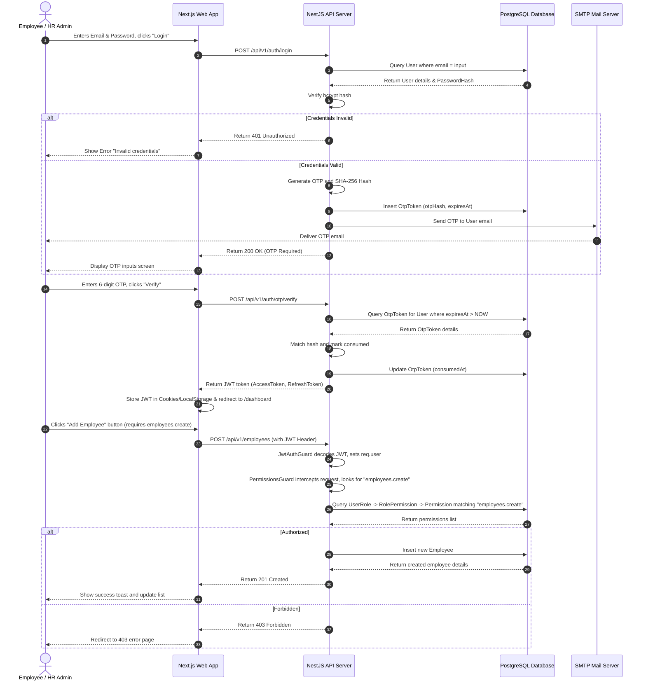

# Module 1 Specs: Authentication & Access Control (RBAC)

This document provides a comprehensive technical reference for the **Authentication & Access Control (RBAC)** module of SKYLINX PeopleOS HRMS, detailing database schemas, backend NestJS controllers, frontend Next.js pages, role permissions, and end-to-end data flows.

---

## 1. Functional Purpose & Business Logic

The system enforces security and multi-tenancy isolation at both application and database levels:

1.  **Multi-Tenancy Isolation**:
    *   Requests include a tenant identifier (decoded from the user's JWT).
    *   NestJS Middleware captures this context, routing database queries through Prisma client query filters that automatically inject the caller's verified `companyId` (stored in NestJS `RequestContext` using `AsyncLocalStorage`). This prevents cross-tenant data leaks.
2.  **OTP & Recovery Delivery**:
    *   Logins utilize optional OTP verification. The system generates a cryptographically random 6-digit pin, stores its SHA-256 hash in the `OtpToken` table, and triggers mail delivery via the nodemailer pool (fallback to SMTP Gmail config).
    *   Tokens have a strict 10-minute expiration window.
3.  **Dynamic Role-Based Access Control**:
    *   Permissions are granularly defined by a composite of `module` (e.g. `employees`, `attendance`, `payroll`) and `action` (e.g. `read`, `create`, `update`, `approve`, `configure`).
    *   Roles are dynamically queried from the DB to check matching `RolePermission` entries.

### Dropdown Linkages & Settings Connections
*   **Creating Roles**: Roles are configured in the SaaS Admin or Company Settings Panel (`/settings/security`), where an HR Admin or Owner can check checkboxes corresponding to permissions.
*   **Assigning Roles**: When adding or editing an employee in the Directory (`/employees`), the "Assign Role" dropdown dynamically fetches active roles from the backend API `/api/v1/auth/roles` (stored in the `Role` table), mapping them via `UserRole` table rows.

---

## 2. Detailed Schema & Database Mappings

The configuration uses the following models in `packages/database/prisma/schema.prisma`:

*   **`User`**:
    *   `id` (String CUID, Primary Key)
    *   `email` (String, Unique)
    *   `phone` (String, Unique, Optional)
    *   `passwordHash` (String)
    *   `status` (Enum: `ACTIVE`, `INACTIVE`, `SUSPENDED`)
    *   `lastLoginAt` (DateTime, Optional)
    *   `tenantId` (String CUID, Foreign Key to `Company.id`)
    *   `employeeId` (String CUID, Foreign Key to `Employee.id`, Unique, Optional)
*   **`Role`**:
    *   `id` (String CUID, Primary Key)
    *   `name` (String, Unique)
    *   `description` (String, Optional)
    *   `isSystemRole` (Boolean, Default: `false`)
    *   `tenantId` (String CUID, Foreign Key to `Company.id`, Optional)
*   **`Permission`**:
    *   `id` (String CUID, Primary Key)
    *   `module` (String, e.g. "employees", "attendance", "payroll")
    *   `action` (String, e.g. "read", "create", "update", "approve")
    *   `description` (String, Optional)
    *   *Constraint*: Unique composite index `@@unique([module, action])`
*   **`UserRole`**:
    *   `id` (String CUID, Primary Key)
    *   `userId` (String CUID, Foreign Key to `User.id`)
    *   `roleId` (String CUID, Foreign Key to `Role.id`)
    *   *Constraint*: Unique composite index `@@unique([userId, roleId])`
*   **`RolePermission`**:
    *   `id` (String CUID, Primary Key)
    *   `roleId` (String CUID, Foreign Key to `Role.id`)
    *   `permissionId` (String CUID, Foreign Key to `Permission.id`)
    *   *Constraint*: Unique composite index `@@unique([roleId, permissionId])`
*   **`OtpToken`**:
    *   `id` (String CUID, Primary Key)
    *   `userId` (String CUID, Foreign Key to `User.id`)
    *   `channel` (String, e.g. "EMAIL")
    *   `otpHash` (String, SHA-256)
    *   `expiresAt` (DateTime)
    *   `consumedAt` (DateTime, Optional)

---

## 3. NestJS API Controllers & Services

*   **Folder Location**: `apps/api/src/modules/auth` (and related `common/auth`)
*   **Controller**: `auth.controller.ts`
*   **Endpoints**:
    *   `POST /api/v1/auth/login`: Validates user credentials. Returns JWT access token and refresh token.
    *   `POST /api/v1/auth/otp/request`: Generates and hashes 6-digit OTP, stores it in `OtpToken`, sends verification email.
    *   `POST /api/v1/auth/otp/verify`: Validates OTP against stored hash, marks token as consumed, returns active session payload.
    *   `GET /api/v1/auth/me`: Parses request JWT header and returns authenticated User profile details.
*   **Guards**:
    *   `JwtAuthGuard`: Extracts JWT, decodes payloads, validates against Active User registry, attaches `req.user`.
    *   `PermissionsGuard`: Intercepts route invocations, extracts decorator metadata (`@RequirePermissions('module.action')`), checks whether the user's roles contain the required permission, and returns `403 Forbidden` on failure.

---

## 4. Next.js UI Screens & Multi-Role View Mappings

*   **Files**:
    *   `apps/web/app/login/page.tsx`
    *   `apps/web/components/login-form.tsx`
    *   `apps/web/app/settings/security/page.tsx` (Role configuration)

### A. Owner / Super Admin View
*   **Access Requirements**: Role `OWNER` or `SUPER_ADMIN` with global configurations permission.
*   **UI Controls**:
    *   Accesses SaaS Tenant management settings.
    *   `Toggle Status` button: Suspends or activates company access globally.
    *   `Configure Plan` dropdown: Maps subscriber status to platform limits.

### B. HR Admin View
*   **Access Requirements**: Role `HR_ADMIN` with `employees.update` and settings configuration permissions.
*   **UI Controls**:
    *   `Assign Role` dropdown in Employee Profile page.
    *   `Add Role` / `Save Permissions` buttons inside security settings page.
    *   Sees the complete audit logs table showing user actions and login history.

### C. Manager View
*   **Access Requirements**: Role `MANAGER` with standard permissions.
*   **UI Controls**:
    *   Accesses direct team rosters and approval panels.
    *   Settings tabs and role configurations are completely hidden.

### D. Employee View
*   **Access Requirements**: Role `EMPLOYEE` with self-scope permissions.
*   **UI Controls**:
    *   `Change Password` form inside personal settings.
    *   Cannot access settings, role edits, or list of user logins.

---

## 5. End-to-End Cycle Flowchart

The diagram below details the entire login authentication and RBAC verification lifecycle:

