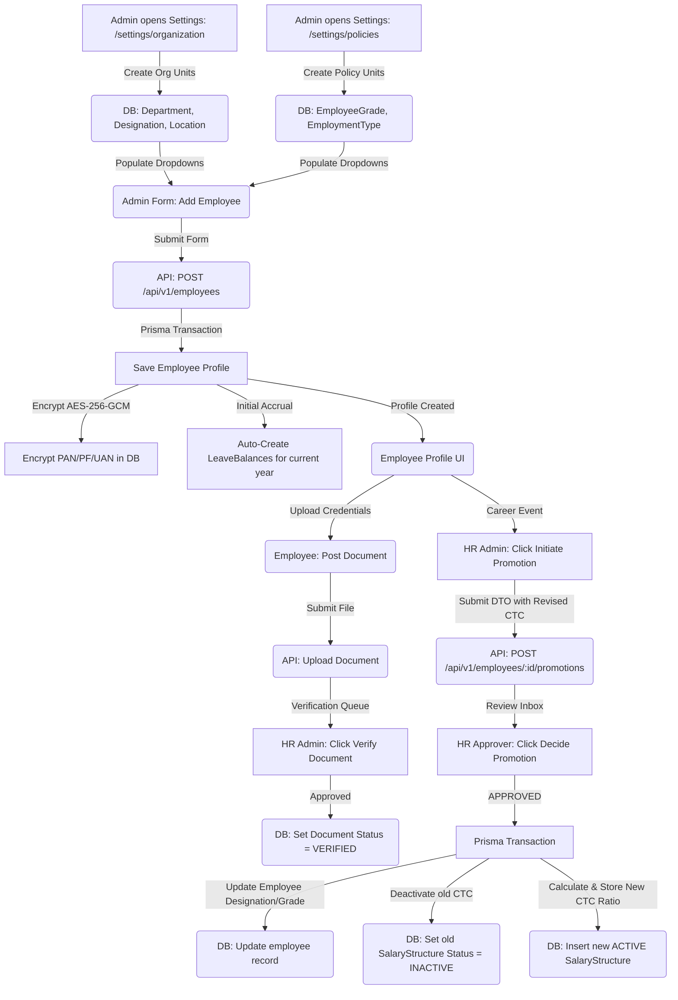

# Module 2 Specs: Employee Directory & Career Lifecycle

This document provides a comprehensive technical reference for the **Employee Directory & Career Lifecycle** module of SKYLINX PeopleOS HRMS, covering database models, backend NestJS controllers, frontend Next.js pages, role permissions, and end-to-end data flows.

---

## 1. Functional Purpose & Business Logic

The Directory module acts as the core registry for employee records and manages organizational transitions (promotions, department transfers, reporting alignments):

1.  **Demographic & Compliance Registry**:
    *   Maintains employee identifiers, personal contacts, banking details, and identification numbers (PAN, PF, UAN).
    *   **Data Security**: Sensitive identifiers such as `panNumber` and `providentFundAccount` are encrypted on write using AES-256-GCM. Bank accounts are similarly protected in the `EmployeeBankDetail` table and masked (showing only the last 4 digits) when serialized.
2.  **Career Transitions**:
    *   **Promotions**: Handled via `EmployeePromotion` records. When approved, it updates the employee's `designationId` and `gradeId` in the `Employee` table, marks the old `SalaryStructure` as `INACTIVE`, and creates a new active salary structure based on the revised CTC.
    *   **Transfers**: Handled via `EmployeeTransfer` records. When approved, it updates the employee's `departmentId`, `locationId`, and `managerId` in the `Employee` table.

### Dropdown Linkages & Connection Completion
*   **Source Fields**: The Employee creation and edit forms utilize dropdown lists for:
    *   **Department**: Sourced from `/api/v1/organization/departments` (linked to `Department` model).
    *   **Designation**: Sourced from `/api/v1/organization/designations` (linked to `Designation` model).
    *   **Location**: Sourced from `/api/v1/organization/locations` (linked to `Location` model).
    *   **Grade**: Sourced from `/api/v1/employees/grades/:companyId` (linked to `EmployeeGrade` model).
    *   **Employment Type**: Sourced from `/api/v1/employees/types/:companyId` (linked to `EmploymentType` model).
*   **Dropdown Administration**: 
    *   Admins can create or edit Departments, Designations, and Locations inside the Organization Settings panel (`/settings/organization`).
    *   Grades (which set the `maxExpenseLimit` for Module 6 claims) and Employment Types (e.g., Full-Time, Contractor) are configured in the Policies Panel (`/settings/policies`).
    *   Any changes made in these settings are instantly populated in the dropdown menus of the Employee Directory forms, completing the lifecycle connection.

---

## 2. Detailed Schema & Database Mappings

The directory and career lifecycle utilize the following models in `packages/database/prisma/schema.prisma`:

*   **`Employee`**:
    *   `id` (String CUID, Primary Key)
    *   `employeeCode` (String)
    *   `firstName` (String)
    *   `lastName` (String)
    *   `email` (String, Unique)
    *   `phone` (String, Optional)
    *   `gender` (String, Optional)
    *   `dateOfBirth` (DateTime, Optional)
    *   `joiningDate` (DateTime)
    *   `departmentId` (String CUID, Foreign Key to `Department.id`, Optional)
    *   `designationId` (String CUID, Foreign Key to `Designation.id`, Optional)
    *   `locationId` (String CUID, Foreign Key to `Location.id`, Optional)
    *   `managerId` (String CUID, Foreign Key to `Employee.id`, Optional)
    *   `gradeId` (String CUID, Foreign Key to `EmployeeGrade.id`, Optional)
    *   `employmentTypeId` (String CUID, Foreign Key to `EmploymentType.id`, Optional)
    *   `panNumber` (String, Encrypted, Optional)
    *   `providentFundAccount` (String, Encrypted, Optional)
    *   `uan` (String, Optional)
    *   `status` (Enum: `ACTIVE`, `INACTIVE`, `EXITED`)
    *   *Constraint*: Unique composite index `@@unique([companyId, employeeCode])`
*   **`EmployeeDocument`**:
    *   `id` (String CUID, Primary Key)
    *   `employeeId` (String CUID, Foreign Key to `Employee.id`)
    *   `documentType` (String, e.g. "Aadhaar", "PAN")
    *   `fileUrl` (String)
    *   `verificationStatus` (String, Default: "PENDING")
    *   `verifiedBy` (String, Optional)
    *   `verifiedAt` (DateTime, Optional)
*   **`EmployeeBankDetail`**:
    *   `id` (String CUID, Primary Key)
    *   `employeeId` (String CUID, Foreign Key to `Employee.id`, Unique)
    *   `accountHolderName` (String)
    *   `bankName` (String)
    *   `accountNumberEncrypted` (String)
    *   `ifsc` (String)
    *   `branch` (String, Optional)
*   **`EmployeeGrade`**:
    *   `id` (String CUID, Primary Key)
    *   `companyId` (String CUID)
    *   `name` (String)
    *   `description` (String, Optional)
    *   `maxExpenseLimit` (Decimal, Default: 0)
*   **`EmploymentType`**:
    *   `id` (String CUID, Primary Key)
    *   `companyId` (String CUID)
    *   `name` (String)
*   **`EmployeePromotion`**:
    *   `id` (String CUID, Primary Key)
    *   `employeeId` (String CUID, Foreign Key to `Employee.id`)
    *   `fromDesignationId` (String CUID)
    *   `toDesignationId` (String CUID)
    *   `fromGradeId` (String CUID, Optional)
    *   `toGradeId` (String CUID, Optional)
    *   `revisedCtc` (Decimal, Optional)
    *   `effectiveDate` (DateTime)
    *   `status` (Enum/String: `PENDING`, `APPROVED`, `REJECTED`)
*   **`EmployeeTransfer`**:
    *   `id` (String CUID, Primary Key)
    *   `employeeId` (String CUID, Foreign Key to `Employee.id`)
    *   `fromDepartmentId` (String CUID, Optional)
    *   `toDepartmentId` (String CUID, Optional)
    *   `fromLocationId` (String CUID, Optional)
    *   `toLocationId` (String CUID, Optional)
    *   `newManagerId` (String CUID, Optional)
    *   `effectiveDate` (DateTime)
    *   `status` (Enum/String: `PENDING`, `APPROVED`, `REJECTED`)

---

## 3. NestJS API Controllers & Services

*   **Folder Location**: `apps/api/src/modules/employees`
*   **Controller**: `employees.controller.ts`
*   **Endpoints**:
    *   `GET /api/v1/employees`: Returns the company's active directory.
    *   `POST /api/v1/employees`: Creates a new employee profile. Simultaneously triggers automatic creation of standard `LeaveBalance` records for the current year.
    *   `GET/PATCH /api/v1/employees/:id`: Profile details retrieval and updates.
    *   `POST /api/v1/employees/:id/documents/upload`: Multer file upload, logs a new `EmployeeDocument`.
    *   `PATCH /api/v1/employees/:id/documents/:documentId/verify`: Admin verification toggle.
    *   `POST /api/v1/employees/:id/promotions`: Submits a promotion request.
    *   `POST /api/v1/employees/promotions/:id/decide`: Approves/rejects promotions. If approved, updates designation, grade, and constructs revised active `SalaryStructure`.
    *   `POST /api/v1/employees/:id/transfers`: Submits a transfer request.
    *   `POST /api/v1/employees/transfers/:id/decide`: Approves/rejects department/location transfers.

---

## 4. Next.js UI Screens & Multi-Role View Mappings

*   **Files**:
    *   `apps/web/app/employees/page.tsx` (Directory list)
    *   `apps/web/app/employees/[id]/page.tsx` (Detailed employee card)
    *   `apps/web/components/employees-console.tsx`

### A. HR Admin View
*   **Access Requirements**: Role `HR_ADMIN` or `OWNER` with `employees.create`, `employees.update`, `employees.approve`.
*   **UI Controls**:
    *   `Add Employee` button: Opens profile form with Location, Designation, Department, Grade, and Employment Type dropdowns.
    *   `Initiate Promotion` / `Initiate Transfer` buttons: Opens modals to schedule changes.
    *   `Verify Documents` button: Appears next to uploaded employee credentials.
*   **Fields**: Complete visibility of bank accounts and salary parameters.

### B. Manager View
*   **Access Requirements**: Role `MANAGER` with `employees.read`.
*   **UI Controls**:
    *   Sees team directory grid. Can view profiles of direct reports.
    *   Cannot edit profiles, initiate promotions, or view decrypted banking details of reports.

### C. Employee View
*   **Access Requirements**: Role `EMPLOYEE` with self-scope permissions.
*   **UI Controls**:
    *   Sees personal profile dashboard. Can edit contact details (phone, email).
    *   All admin actions, document verification buttons, and salary adjustments are completely hidden.

---

## 5. End-to-End Cycle Flowchart

This flowchart outlines the complete Employee Lifecycle, including onboarding, career events, and data changes:

