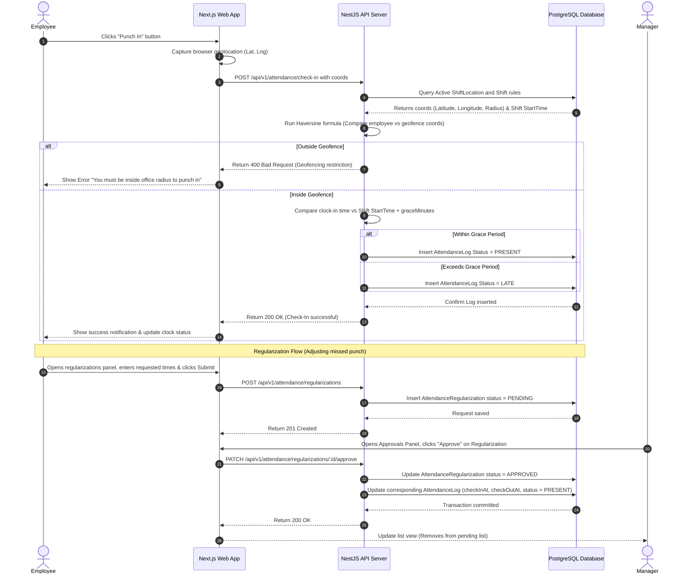

# Module 3 Specs: Attendance & Shift Roster

This document provides a comprehensive technical reference for the **Attendance & Shift Roster** module of SKYLINX PeopleOS HRMS, covering database models, backend NestJS controllers, frontend Next.js pages, role permissions, and end-to-end data flows.

---

## 1. Functional Purpose & Business Logic

The Attendance module tracks employee work hours, geofences clock-in attempts, maps shift assignments, and resolves punch adjustments:

1.  **Geofenced Punch Validation**:
    *   Restricts punch actions to physical office boundaries.
    *   During clock-in, the system queries browser GPS coordinates and computes the distance (using the Haversine formula on the backend) against all active `ShiftLocation` coordinates defined for the company. If the distance exceeds the designated `radiusInMeters`, the API rejects the request with a `400 Bad Request` geofencing violation error.
2.  **Grace Periods & Tardiness**:
    *   Compares the daily check-in time against the employee's assigned `Shift` start time.
    *   If check-in occurs after `startTime + graceMinutes` (defined in the `Shift` model), the status is logged as `LATE`.
    *   If check-in exceeds `halfDayMinutes` from shift start, the record is flagged as `HALF_DAY`.
3.  **Auto-Punch Processor**:
    *   A nightly cron processor runs to compare actual `AttendanceLog` entries against the assigned `ShiftAssignment`.
    *   If no check-in exists for a scheduled day (excluding holidays or week-offs), it inserts an `ABSENT` log.

### Dropdown Linkages & Connection Completion
*   **Source Fields**: The roster and shift assign systems pull directly from:
    *   **Shift Locations**: Defined in settings, holding office GPS coordinates, names, and radii.
    *   **Shift List**: Sourced dynamically from `/api/v1/attendance/shifts` (linked to `Shift` model).
*   **Dropdown Administration**: 
    *   Admins manage shift patterns (e.g. morning, evening, night shifts) and grace rules in Settings under the Attendance Rules page (`/settings/attendance`).
    *   New office branches or geofencing zones are entered under the Locations page (`/settings/locations`), updating the `ShiftLocation` table.
    *   When an HR Admin schedules employee shifts in the Roster Planner calendar (`/attendance/roster`), the "Select Shift" dropdown pulls from these configured options.
    *   Employees sending shift swap requests (`ShiftRequest`) see dynamic dropdown listings of eligible coworkers in their department.

---

## 2. Detailed Schema & Database Mappings

The attendance module revolves around the following models in `packages/database/prisma/schema.prisma`:

*   **`Shift`**:
    *   `id` (String CUID, Primary Key)
    *   `companyId` (String CUID)
    *   `name` (String, e.g. "General Shift")
    *   `startTime` (String, e.g. "09:00")
    *   `endTime` (String, e.g. "18:00")
    *   `graceMinutes` (Int, Default: 0)
    *   `halfDayMinutes` (Int, Default: 240)
    *   `status` (String, Default: "ACTIVE")
*   **`ShiftAssignment`**:
    *   `id` (String CUID, Primary Key)
    *   `employeeId` (String CUID, Foreign Key to `Employee.id`)
    *   `shiftId` (String CUID, Foreign Key to `Shift.id`)
    *   `date` (DateTime)
    *   *Constraint*: Unique composite index `@@unique([employeeId, date])`
*   **`ShiftRequest`**:
    *   `id` (String CUID, Primary Key)
    *   `employeeId` (String CUID, Foreign Key to `Employee.id`)
    *   `shiftId` (String CUID, Foreign Key to `Shift.id`)
    *   `requestedDate` (DateTime)
    *   `reason` (String, Optional)
    *   `status` (Enum: `PENDING`, `APPROVED`, `REJECTED`)
*   **`ShiftLocation`**:
    *   `id` (String CUID, Primary Key)
    *   `shiftId` (String CUID, Foreign Key to `Shift.id`)
    *   `locationId` (String CUID, Foreign Key to `Location.id`)
    *   *Constraint*: Unique composite index `@@unique([shiftId, locationId])`
*   **`AttendanceRule`**:
    *   `id` (String CUID, Primary Key)
    *   `companyId` (String CUID, Unique)
    *   `lateMarkAfterMinutes` (Int, Default: 10)
    *   `maxLateMarksPerMonth` (Int, Default: 3)
    *   `geoRequired` (Boolean, Default: false)
    *   `selfieRequired` (Boolean, Default: false)
    *   `biometricRequired` (Boolean, Default: false)
    *   `overtimeEnabled` (Boolean, Default: true)
*   **`AttendanceLog`**:
    *   `id` (String CUID, Primary Key)
    *   `employeeId` (String CUID, Foreign Key to `Employee.id`)
    *   `shiftId` (String CUID, Foreign Key to `Shift.id`, Optional)
    *   `date` (DateTime)
    *   `checkInAt` (DateTime, Optional)
    *   `checkOutAt` (DateTime, Optional)
    *   `checkInLatitude` (Decimal, Optional)
    *   `checkInLongitude` (Decimal, Optional)
    *   `status` (Enum: `PRESENT`, `LATE`, `ABSENT`, `HALF_DAY`, `HOLIDAY`, `WEEK_OFF`)
    *   *Constraint*: Unique composite index `@@unique([employeeId, date])`
*   **`AttendanceRegularization`**:
    *   `id` (String CUID, Primary Key)
    *   `employeeId` (String CUID, Foreign Key to `Employee.id`)
    *   `attendanceLogId` (String CUID, Foreign Key to `AttendanceLog.id`, Optional)
    *   `requestedCheckInAt` (DateTime, Optional)
    *   `requestedCheckOutAt` (DateTime, Optional)
    *   `reason` (String)
    *   `status` (Enum: `PENDING`, `APPROVED`, `REJECTED`)
*   **`OvertimeRequest`**:
    *   `id` (String CUID, Primary Key)
    *   `employeeId` (String CUID, Foreign Key to `Employee.id`)
    *   `attendanceLogId` (String CUID, Foreign Key to `AttendanceLog.id`)
    *   `hours` (Decimal)
    *   `reason` (String)
    *   `status` (Enum: `PENDING`, `APPROVED`, `REJECTED`)

---

## 3. NestJS API Controllers & Services

*   **Folder Location**: `apps/api/src/modules/attendance`
*   **Controller**: `attendance.controller.ts`
*   **Endpoints**:
    *   `POST /api/v1/attendance/check-in`: Parses coordinates, runs Haversine distance matches, matches schedule time, and inserts `AttendanceLog` with status (`PRESENT`/`LATE`).
    *   `POST /api/v1/attendance/check-out`: Updates matching record check-out timestamp.
    *   `GET /api/v1/attendance/logs`: Returns tenant logs.
    *   `POST /api/v1/attendance/shifts`: Creates new Shifts.
    *   `POST /api/v1/attendance/shifts/assign`: Schedules shifts.
    *   `POST /api/v1/attendance/regularizations`: Submits punch adjustments.
    *   `PATCH /api/v1/attendance/regularizations/:id/approve`: Decides regularization. If approved, modifies corresponding check-in/out timestamps and updates status to `PRESENT`.

---

## 4. Next.js UI Screens & Multi-Role View Mappings

*   **Files**:
    *   `apps/web/app/attendance/page.tsx`
    *   `apps/web/components/attendance-console.tsx`
    *   `apps/web/components/roster-console.tsx` (Rotational planner)

### A. HR Admin View
*   **Access Requirements**: Role `HR_ADMIN` or `OWNER` with `attendance.read`, `attendance.configure`.
*   **UI Controls**:
    *   `Roster Planner Grid`: Displays interactive calendars where shifts are assigned to departments via drag-and-drop.
    *   `Add Location Coordinates` button inside the Locations admin modal.
    *   `Re-Run Punch Sync` button: Manually triggers the nightly absentee processing cron.

### B. Manager View
*   **Access Requirements**: Role `MANAGER` with `attendance.approve`.
*   **UI Controls**:
    *   `Approvals Inbox` tab: Contains tables of regularization and overtime requests from subordinates.
    *   `Approve` & `Reject` buttons next to each pending adjustment record.
    *   Sees the shift roster calendar representing direct department subordinates only.

### C. Employee View
*   **Access Requirements**: Role `EMPLOYEE` with self-scope permissions.
*   **UI Controls**:
    *   `Punch In` / `Punch Out` buttons: Dynamically requests current location via browser APIs, validates, and logs punches.
    *   `Request Regularization` button: Opens a modal with time inputs and reason text fields.
    *   Sees personal calendar with color-coded daily status indicators (e.g. green for present, yellow for late, red for absent).

---

## 5. End-to-End Cycle Flowchart

This flowchart outlines the complete attendance verification and punch regularization journey:

