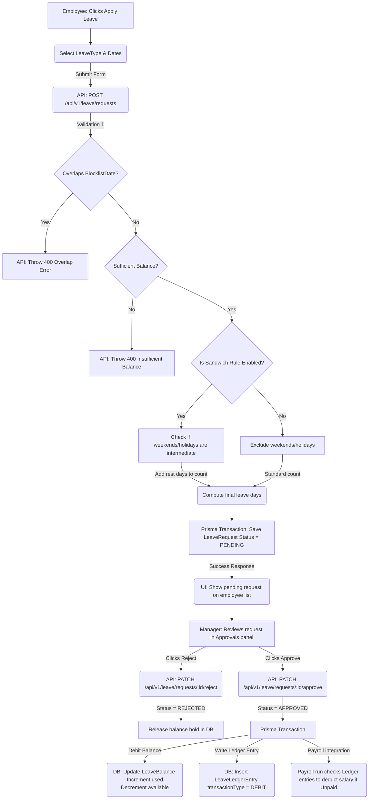

# Module 4 Specs: Leave Management

This document provides a comprehensive technical reference for the **Leave Management** module of SKYLINX PeopleOS HRMS, covering database models, backend NestJS controllers, frontend Next.js pages, role permissions, and end-to-end data flows.

---

## 1. Functional Purpose & Business Logic

The Leave module controls employee time-off requests, balances, accrual runs, compensatory conversions, encashments, and business operations blockouts:

1.  **Leave Request Validation Rules**:
    *   **Sandwich Rule**: If enabled on a `LeaveType`, if an employee requests leave spanning a weekend or holiday (e.g., Friday and the following Monday), the system automatically counts the intermediate rest days (Saturday and Sunday) as active leave days.
    *   **Leave Blocklists**: Admins configure dates during which leaves are barred (e.g. major product release dates, financial year-end audits). The system checks the requested start and end dates against `LeaveBlockListDate`. If they overlap, it raises a `400 Bad Request` blocklist overlap validation exception.
    *   **Balance Sufficiency**: Ensures requested days do not exceed `LeaveBalance.available` for that year.
2.  **Earned Accrual & Ledger Entries**:
    *   Automates leave credit injections (monthly or quarterly) based on `LeaveAccrualSchedule` mapping rules.
    *   Maintains a detailed `LeaveLedgerEntry` audit trail registering the state change (`ACCRUAL`, `DEBIT` for approved leaves, `CREDIT` for cancellations/reversals, or `ENCASHMENT`).
3.  **Comp-Off Conversion**:
    *   Allows employees to convert approved `OvertimeRequest` hours into paid time-off days. Creates a `CompOffConversion` link; once approved, it increments the employee's compensatory leave balance.
4.  **Leave Encashment**:
    *   Allows employees to cash out accumulated leave days. Computes pay rate per day; once approved, it logs a `DEBIT` entry in the leave ledger and sets up salary addition parameters for payroll processing.

### Dropdown Linkages & Connection Completion
*   **Source Fields**: 
    *   **Leave Type Selector**: When an employee applies for leave, they select from active Leave Types (e.g. Sick Leave, Casual Leave, Comp-Off) dynamically fetched from `/api/v1/leave/types`.
    *   **Overtime Request Selection**: Comp-off requests fetch approved overtime logs of the employee from `/api/v1/attendance/overtime` to convert them into leaves.
*   **Dropdown Administration**:
    *   Admins define leave types (setting quotas and toggles like sandwich rule or carry-forward permissions) inside the Leave Types settings panel (`/settings/leaves/types`).
    *   Critical calendar lockouts are defined in the Leave Blocklist settings panel (`/settings/leaves/block-lists`), updating the `LeaveBlockListDate` table.
    *   Policies and allocation rules are assigned via `/settings/leaves/policies`.
    *   Any changes made in these settings are instantly populated in the dropdown menus of the Leave console forms, completing the lifecycle connection.

---

## 2. Detailed Schema & Database Mappings

The leave module uses the following models in `packages/database/prisma/schema.prisma`:

*   **`LeaveType`**:
    *   `id` (String CUID, Primary Key)
    *   `companyId` (String CUID)
    *   `name` (String, e.g. "Casual Leave")
    *   `code` (String)
    *   `annualQuota` (Int)
    *   `carryForwardAllowed` (Boolean, Default: false)
    *   `sandwichRuleEnabled` (Boolean, Default: false)
    *   `compOffLinked` (Boolean, Default: false)
    *   `status` (String, Default: "ACTIVE")
    *   *Constraint*: Unique composite index `@@unique([companyId, code])`
*   **`LeaveBalance`**:
    *   `id` (String CUID, Primary Key)
    *   `employeeId` (String CUID, Foreign Key to `Employee.id`)
    *   `leaveTypeId` (String CUID, Foreign Key to `LeaveType.id`)
    *   `year` (Int)
    *   `openingBalance` (Decimal, Default: 0)
    *   `accrued` (Decimal, Default: 0)
    *   `used` (Decimal, Default: 0)
    *   `carriedForward` (Decimal, Default: 0)
    *   `available` (Decimal, Default: 0)
    *   *Constraint*: Unique composite index `@@unique([employeeId, leaveTypeId, year])`
*   **`LeaveRequest`**:
    *   `id` (String CUID, Primary Key)
    *   `employeeId` (String CUID, Foreign Key to `Employee.id`)
    *   `leaveTypeId` (String CUID, Foreign Key to `LeaveType.id`)
    *   `fromDate` (DateTime)
    *   `toDate` (DateTime)
    *   `days` (Decimal)
    *   `reason` (String)
    *   `status` (Enum: `PENDING`, `APPROVED`, `REJECTED`)
    *   `managerId` (String CUID, Optional)
    *   `decidedAt` (DateTime, Optional)
*   **`LeaveBlockList`**:
    *   `id` (String CUID, Primary Key)
    *   `companyId` (String CUID)
    *   `name` (String)
    *   `description` (String, Optional)
*   **`LeaveBlockListDate`**:
    *   `id` (String CUID, Primary Key)
    *   `blockListId` (String CUID, Foreign Key to `LeaveBlockList.id`)
    *   `date` (DateTime)
    *   `reason` (String)
*   **`LeavePolicy`**:
    *   `id` (String CUID, Primary Key)
    *   `companyId` (String CUID)
    *   `name` (String)
    *   `description` (String, Optional)
*   **`LeavePolicyAssignment`**:
    *   `id` (String CUID, Primary Key)
    *   `employeeId` (String CUID, Foreign Key to `Employee.id`)
    *   `policyId` (String CUID, Foreign Key to `LeavePolicy.id`)
    *   `effectiveFrom` (DateTime)
*   **`LeaveLedgerEntry`**:
    *   `id` (String CUID, Primary Key)
    *   `employeeId` (String CUID, Foreign Key to `Employee.id`)
    *   `leaveTypeId` (String CUID, Foreign Key to `LeaveType.id`)
    *   `transactionDate` (DateTime)
    *   `transactionType` (Enum: `ACCRUAL`, `DEBIT`, `CREDIT`, `ENCASHMENT`)
    *   `days` (Decimal)
    *   `remarks` (String, Optional)
*   **`LeaveEncashment`**:
    *   `id` (String CUID, Primary Key)
    *   `employeeId` (String CUID, Foreign Key to `Employee.id`)
    *   `leaveTypeId` (String CUID, Foreign Key to `LeaveType.id`)
    *   `days` (Decimal)
    *   `amountPerDay` (Decimal)
    *   `totalAmount` (Decimal)
    *   `status` (Enum: `PENDING`, `APPROVED`, `REJECTED`)
*   **`LeaveAccrualSchedule`**:
    *   `id` (String CUID, Primary Key)
    *   `leavePolicyId` (String CUID)
    *   `leaveTypeId` (String CUID, Foreign Key to `LeaveType.id`)
    *   `frequency` (String, e.g. "MONTHLY")
    *   `daysPerPeriod` (Decimal)
    *   `lastProcessedPeriod` (String, Optional)
*   **`CompOffConversion`**:
    *   `id` (String CUID, Primary Key)
    *   `employeeId` (String CUID, Foreign Key to `Employee.id`)
    *   `overtimeRequestId` (String CUID, Foreign Key to `OvertimeRequest.id`, Unique)
    *   `leaveTypeId` (String CUID, Foreign Key to `LeaveType.id`)
    *   `daysGranted` (Decimal)
    *   `status` (Enum: `PENDING`, `APPROVED`, `REJECTED`)

---

## 3. NestJS API Controllers & Services

*   **Folder Location**: `apps/api/src/modules/leave`
*   **Controller**: `leave.controller.ts`
*   **Endpoints**:
    *   `POST /api/v1/leave/requests`: Validates leave balances and blocklist dates. Computes sandwich penalties. Subtracts available balance in a draft state and inserts a `LeaveRequest`.
    *   `PATCH /api/v1/leave/requests/:id/approve`: Commits debit to `LeaveBalance.used` and creates a `DEBIT` `LeaveLedgerEntry`.
    *   `PATCH /api/v1/leave/requests/:id/reject`: Reverts available balance hold.
    *   `POST /api/v1/leave/comp-off-conversions`: Submits overtime conversion requests.
    *   `PATCH /api/v1/leave/comp-off-conversions/:id/approve`: Decides conversion, adding credits to comp-off leave types.
    *   `POST /api/v1/leave/encashments`: Submits cashout requests.
    *   `POST /api/v1/leave/accruals/process`: Triggers scheduled leave accruals.

---

## 4. Next.js UI Screens & Multi-Role View Mappings

*   **Files**:
    *   `apps/web/app/leaves/page.tsx`
    *   `apps/web/components/leave-console.tsx`

### A. HR Admin View
*   **Access Requirements**: Role `HR_ADMIN` or `OWNER` with `leave.configure`.
*   **UI Controls**:
    *   `Configure Types` panel: Forms to establish annual quotas, sandwich triggers, and carry-forward rules.
    *   `Create Blocklist` / `Add Date` modals: Visual calendar interface to declare blocklist dates.
    *   `Run Accrual Processor` button: Manually triggers the periodic leave credit run.

### B. Manager View
*   **Access Requirements**: Role `MANAGER` with `leave.approve`.
*   **UI Controls**:
    *   `Pending Approvals` grid: Shows time-off requests, comp-off conversions, and encashments.
    *   `Approve` & `Reject` buttons: Exposes direct decision endpoints.
    *   Sees a team calendar overlay displaying who is off on which days.

### C. Employee View
*   **Access Requirements**: Role `EMPLOYEE` with self-scope permissions.
*   **UI Controls**:
    *   `Apply Leave` button: Opens application form displaying current balance cards. Selecting dates checks for blocklist blockades and displays the final calculated days.
    *   `Request Comp-Off` button: Selects approved overtime logs to request time-off conversion.
    *   `Request Encashment` button: Opens modal specifying number of days to encash.

---

## 5. End-to-End Cycle Flowchart

This flowchart maps the complete lifecycle of leave applications, validation rules, and ledger writes:

