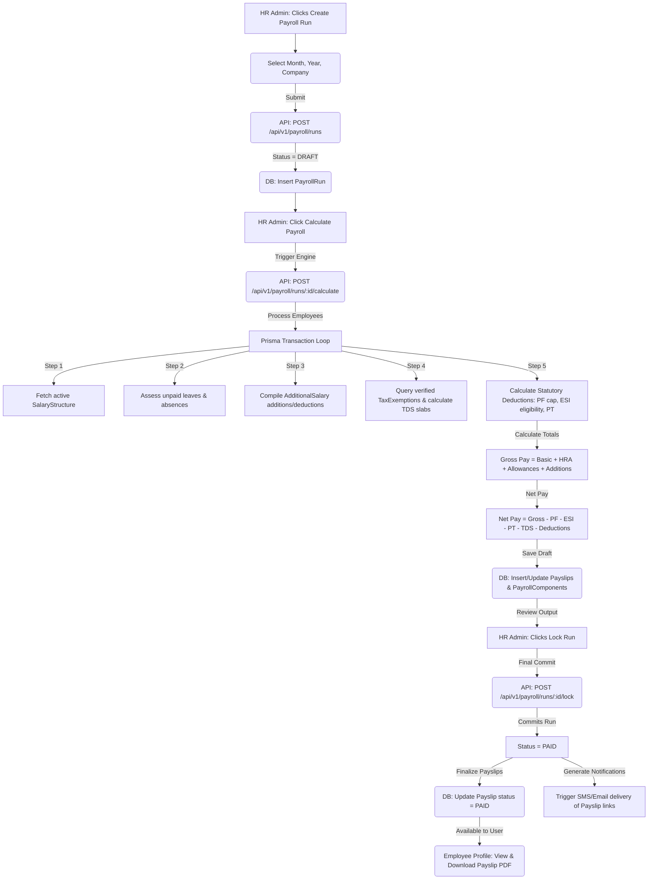

# Module 5 Specs: Payroll & Compliance

This document provides a comprehensive technical reference for the **Payroll & Compliance** module of SKYLINX PeopleOS HRMS, covering database models, backend NestJS controllers, frontend Next.js pages, role permissions, and end-to-end data flows.

---

## 1. Functional Purpose & Business Logic

The Payroll module handles salary generation, tax deductions, benefits tracking, statutory compliance calculations, and Full & Final (F&F) settlements:

1.  **Salary Calculations & Pay Rates**:
    *   Sourced from active `SalaryStructure` profiles mapped to each employee.
    *   **Structure Components**: Automatically divided into Basic (40% of CTC), HRA (50% of Basic), allowances, employer PF contributions, employee PF deductions, ESI, Professional Tax (PT), and TDS (estimated at 5%).
2.  **Statutory Compliance Calculations**:
    *   **Provident Fund (PF)**: Calculates employee and employer contributions at 12% of the basic salary, capped at a maximum basic salary of ₹15,000 per month (annual limit of ₹180,000).
    *   **Employee State Insurance (ESI)**: Applied at 0.75% of gross wages if the monthly CTC does not exceed ₹21,000 (annual ₹252,000).
    *   **Professional Tax (PT)**: Deducted at ₹200 per month (₹2,400 annually).
3.  **Income Tax & TDS Declarations**:
    *   Employees select either the **OLD** or **NEW** tax regime.
    *   Declarations are submitted for Section 80C (PPF, LIC, ELSS capped at ₹1.5 Lakhs), Section 80D (Medical Insurance capped at ₹25k/₹50k), and Section 24 (Home Loan Interest capped at ₹2 Lakhs).
    *   HR Admins verify uploaded receipts (`EmployeeTaxExemptionProofSubmission`). Verified values adjust the computed annual taxable income and revise monthly TDS deductions.
4.  **Full & Final Settlement Calculations**:
    *   Calculates service tenure (exit date minus joining date).
    *   **Gratuity**: If tenure $\ge$ 5 years, compiles gratuity using the formula:
        $$\text{Gratuity} = \text{lastDrawnSalary} \times \frac{15}{26} \times \text{serviceYears}$$
    *   Sums unpaid salary, approved leave encashment balances, and gratuity, then subtracts outstanding loan balances and unreturned asset recovery fees (`FullAndFinalAsset` cost) to output `netPayable`.

### Dropdown Linkages & Connection Completion
*   **Source Fields**: 
    *   **Additional Salary Form**: Selecting an employee triggers lists of active additions/deductions.
    *   **Tax Declarations Form**: Contains regime options ("OLD", "NEW") and financial year selections (e.g. "2026-2027").
    *   **F&F Setup Panel**: Collects exit properties and pulls outstanding recoveries dynamically from approved loan balances and unreturned office items.
*   **Dropdown Administration**:
    *   Tax slabs are managed under the Tax Slabs settings page (`/settings/payroll/tax-slabs`), updating the `IncomeTaxSlab` table.
    *   Gratuity formulas and PF caps are adjusted in the Payroll Rules page (`/settings/payroll/rules`), updating the `GratuityRule` table.
    *   Any changes made in these settings are instantly populated in the dropdown menus of the payroll and tax declaration screens.

---

## 2. Detailed Schema & Database Mappings

The payroll and compliance module uses the following models in `packages/database/prisma/schema.prisma`:

*   **`SalaryStructure`**:
    *   `id` (String CUID, Primary Key)
    *   `employeeId` (String CUID, Foreign Key to `Employee.id`)
    *   `effectiveFrom` (DateTime)
    *   `annualCtc` (Decimal)
    *   `basic` (Decimal)
    *   `hra` (Decimal)
    *   `allowances` (Decimal, Default: 0)
    *   `employerPf` (Decimal, Default: 0)
    *   `employeePf` (Decimal, Default: 0)
    *   `esi` (Decimal, Default: 0)
    *   `professionalTax` (Decimal, Default: 0)
    *   `tds` (Decimal, Default: 0)
    *   `status` (String, Default: "ACTIVE")
*   **`PayrollRun`**:
    *   `id` (String CUID, Primary Key)
    *   `companyId` (String CUID, Foreign Key to `Company.id`)
    *   `month` (Int)
    *   `year` (Int)
    *   `status` (Enum/String: `DRAFT`, `PENDING`, `APPROVED`, `PAID`)
    *   *Constraint*: Unique composite index `@@unique([companyId, month, year])`
*   **`Payslip`**:
    *   `id` (String CUID, Primary Key)
    *   `payrollRunId` (String CUID, Foreign Key to `PayrollRun.id`)
    *   `employeeId` (String CUID, Foreign Key to `Employee.id`)
    *   `grossPay` (Decimal)
    *   `deductions` (Decimal)
    *   `netPay` (Decimal)
    *   `fileUrl` (String, Optional)
    *   `status` (Enum/String: `DRAFT`, `PENDING`, `APPROVED`, `PAID`)
    *   *Constraint*: Unique composite index `@@unique([payrollRunId, employeeId])`
*   **`PayrollComponent`**:
    *   `id` (String CUID, Primary Key)
    *   `payslipId` (String CUID, Foreign Key to `Payslip.id`)
    *   `type` (String, e.g. "EARNING", "DEDUCTION")
    *   `name` (String, e.g. "HRA")
    *   `amount` (Decimal)
*   **`AdditionalSalary`**:
    *   `id` (String CUID, Primary Key)
    *   `employeeId` (String CUID, Foreign Key to `Employee.id`)
    *   `amount` (Decimal)
    *   `type` (String, e.g. "ADDITION", "DEDUCTION")
    *   `name` (String, e.g. "Festive Bonus")
    *   `date` (DateTime)
*   **`IncomeTaxSlab`**:
    *   `id` (String CUID, Primary Key)
    *   `regime` (String, e.g. "NEW")
    *   `fromAmount` (Decimal)
    *   `toAmount` (Decimal, Optional)
    *   `ratePercent` (Decimal)
    *   `surcharge` (Decimal, Default: 0)
*   **`EmployeeTaxExemptionDeclaration`**:
    *   `id` (String CUID, Primary Key)
    *   `employeeId` (String CUID, Foreign Key to `Employee.id`, Unique)
    *   `financialYear` (String)
    *   `regime` (String)
    *   `section80C` (Decimal, Default: 0)
    *   `section80D` (Decimal, Default: 0)
    *   `section24` (Decimal, Default: 0)
    *   `otherExemptions` (Decimal, Default: 0)
*   **`EmployeeTaxExemptionProofSubmission`**:
    *   `id` (String CUID, Primary Key)
    *   `employeeId` (String CUID, Foreign Key to `Employee.id`)
    *   `financialYear` (String)
    *   `sectionType` (String)
    *   `declaredAmount` (Decimal)
    *   `actualAmount` (Decimal)
    *   `fileUrl` (String)
    *   `status` (Enum/String: `PENDING`, `APPROVED`, `REJECTED`)
*   **`GratuityRule`**:
    *   `id` (String CUID, Primary Key)
    *   `companyId` (String CUID, Unique)
    *   `minYears` (Decimal, Default: 5)
    *   `multiplier` (Decimal, Default: 0.5769)
*   **`Gratuity`**:
    *   `id` (String CUID, Primary Key)
    *   `employeeId` (String CUID, Foreign Key to `Employee.id`)
    *   `yearsOfService` (Decimal)
    *   `lastBasic` (Decimal)
    *   `amount` (Decimal)
    *   `status` (Enum/String: `PENDING`, `APPROVED`, `REJECTED`)
*   **`PayrollCorrection`**:
    *   `id` (String CUID, Primary Key)
    *   `payslipId` (String CUID, Foreign Key to `Payslip.id`)
    *   `type` (String, e.g. "ARREAR")
    *   `amount` (Decimal)
    *   `reason` (String)
    *   `status` (Enum/String: `PENDING`, `APPROVED`, `REJECTED`)
*   **`SalaryWithholding`**:
    *   `id` (String CUID, Primary Key)
    *   `companyId` (String CUID, Foreign key to `Company.id`)
    *   `employeeId` (String CUID, Foreign key to `Employee.id`)
    *   `fromDate` (DateTime)
    *   `toDate` (DateTime, Optional)
    *   `reason` (String, Optional)
    *   `status` (String, Default: "ACTIVE")

---

## 3. NestJS API Controllers & Services

*   **Folder Location**: `apps/api/src/modules/payroll`
*   **Controller**: `payroll.controller.ts`
*   **Endpoints**:
    *   `POST /api/v1/payroll/runs`: Instantiates a `PayrollRun` in a draft state for a specified month/year.
    *   `POST /api/v1/payroll/runs/:id/calculate`: Aggregates active salary structures, checks attendance absentees, computes TDS slabs, evaluates additional salary lists, and writes `Payslip` entries.
    *   `POST /api/v1/payroll/runs/:id/lock`: Commits the run. Generates final payslips, updates ledger entries, and generates notifications.
    *   `POST /api/v1/payroll/tax-declarations`: Employees declare annual tax goals.
    *   `POST /api/v1/payroll/tax-proofs`: Submits verification PDFs.
    *   `PATCH /api/v1/payroll/tax-proofs/:id/decide`: Approves/rejects proof forms, re-evaluating tax equations.
    *   `POST /api/v1/payroll/additional-salary`: Appends ad-hoc adjustments.

---

## 4. Next.js UI Screens & Multi-Role View Mappings

*   **Files**:
    *   `apps/web/app/payroll/page.tsx`
    *   `apps/web/components/payroll-console.tsx`

### A. HR Admin View
*   **Access Requirements**: Role `HR_ADMIN` or `OWNER` with `payroll.create`, `payroll.approve`.
*   **UI Controls**:
    *   `Create Payroll Run` button: Opens run configurations modal.
    *   `Calculate` & `Lock Run` buttons inside the payroll checklist dashboard.
    *   `Export Bank sheet` button: Downloads compiled payroll CSV.
    *   `Verify Proof` panel: Visual dashboard to review tax proofs.

### B. Manager View
*   **Access Requirements**: Role `MANAGER` with standard permissions.
*   **UI Controls**:
    *   Can view department salary summaries.
    *   Cannot calculate runs or modify tax slabs.

### C. Employee View
*   **Access Requirements**: Role `EMPLOYEE` with self-scope permissions.
*   **UI Controls**:
    *   `My Payslips` tab: List of locked payslips with `Download PDF` actions.
    *   `Declaration Portal` panel: Forms to select old/new regimes and input Section 80C/80D/24 limits.
    *   `Upload Proof` button: Exposes PDF attachment fields.

---

## 5. End-to-End Cycle Flowchart

This flowchart outlines the complete salary, deduction, compliance, and lock cycle:

