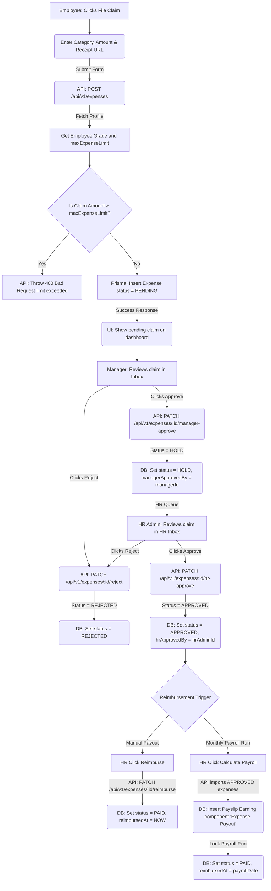

# Module 6 Specs: Expense Claims

This document provides a comprehensive technical reference for the **Expense Claims** module of SKYLINX PeopleOS HRMS, covering database models, backend NestJS controllers, frontend Next.js pages, role permissions, and end-to-end data flows.

---

## 1. Functional Purpose & Business Logic

The Expense module processes employee business expenditure reimbursement requests, enforces grade limits, and tracks approvals:

1.  **Grade-Based Spending Caps**:
    *   Sourced from the employee's `EmployeeGrade.maxExpenseLimit` (configured under settings).
    *   During expense submission, the system fetches the employee's grade limit. If the claimed `amount` exceeds the designated limit, the API blocks the request, returning a `400 Bad Request` limit violation error.
2.  **Dual-Stage Approval Workflow**:
    *   **Stage 1 (Manager Approval)**: A newly created claim (`PENDING`) is routed to the manager. Clicks to approve transition the state to `HOLD` (representing manager approval) and saves the manager's ID in `managerApprovedBy`.
    *   **Stage 2 (HR Approval)**: HR reviews manager-approved claims. Clicks to approve transition the state to `APPROVED` and record the HR administrator's ID in `hrApprovedBy`.
3.  **Reimbursement & Payouts**:
    *   Claims marked `APPROVED` are either reimbursed on-demand (`PAID` status with `reimbursedAt` timestamp) or are aggregated during the next payroll calculation run (`PayrollRun`), being paid out as an "Expense Payout" earning component and marked `PAID`.

### Dropdown Linkages & Connection Completion
*   **Source Fields**: 
    *   **Category List**: When filing a claim, the user selects from standard expense categories (e.g. Travel, Meals, Lodging, Client Entertainment).
    *   **Receipt Attachments**: Expects file uploads, writing the returned CDN path to the `receiptUrl` database column.
*   **Dropdown Administration**:
    *   Reimbursement limits are bound to the employee's grade, which is defined and managed in the Employee Grades settings panel (`/settings/policies/grades`), updating the `maxExpenseLimit` column in the `EmployeeGrade` table.
    *   When an employee changes designations or is promoted, their grade updates, which automatically adjusts their expense caps.

---

## 2. Detailed Schema & Database Mappings

The expense module uses the following models in `packages/database/prisma/schema.prisma`:

*   **`Expense`**:
    *   `id` (String CUID, Primary Key)
    *   `employeeId` (String CUID, Foreign Key to `Employee.id`)
    *   `category` (String, e.g. "Lodging")
    *   `amount` (Decimal)
    *   `receiptUrl` (String, Optional)
    *   `claimDate` (DateTime)
    *   `status` (Enum: `PENDING`, `HOLD`, `APPROVED`, `REJECTED`, `PAID`)
    *   `managerApprovedBy` (String, Optional)
    *   `hrApprovedBy` (String, Optional)
    *   `reimbursedAt` (DateTime, Optional)
*   **`EmployeeGrade`**:
    *   `id` (String CUID, Primary Key)
    *   `companyId` (String CUID)
    *   `name` (String)
    *   `maxExpenseLimit` (Decimal, Default: 0)

---

## 3. NestJS API Controllers & Services

*   **Folder Location**: `apps/api/src/modules/expenses`
*   **Controller**: `expenses.controller.ts`
*   **Endpoints**:
    *   `POST /api/v1/expenses`: Submits claim. Queries employee grade limit, validates, and creates a `PENDING` claim.
    *   `PATCH /api/v1/expenses/:id/manager-approve`: Sets status to `HOLD` and logs manager signature.
    *   `PATCH /api/v1/expenses/:id/hr-approve`: Sets status to `APPROVED` and logs HR signature.
    *   `PATCH /api/v1/expenses/:id/reject`: Reverts status to `REJECTED`.
    *   `PATCH /api/v1/expenses/:id/reimburse`: Marks status as `PAID`.

---

## 4. Next.js UI Screens & Multi-Role View Mappings

*   **Files**:
    *   `apps/web/app/expenses/page.tsx`
    *   `apps/web/components/expense-console.tsx`

### A. HR Admin View
*   **Access Requirements**: Role `HR_ADMIN` or `OWNER` with `expenses.approve`, `expenses.update`.
*   **UI Controls**:
    *   `HR Inbox` tab: Filters and reviews claims at status `HOLD` (manager-approved) or `PENDING`.
    *   `Approve` & `Reject` buttons: Exposes direct action routes.
    *   `Reimburse Payout` button: Triggers on-demand reimbursement checks.

### B. Manager View
*   **Access Requirements**: Role `MANAGER` with `expenses.approve`.
*   **UI Controls**:
    *   `Subordinates Claims` grid: Displays pending claims.
    *   `Approve` & `Reject` buttons: Approving invokes the manager-approval API.
    *   Cannot HR-approve claims or trigger direct payouts.

### C. Employee View
*   **Access Requirements**: Role `EMPLOYEE` with self-scope permissions.
*   **UI Controls**:
    *   `File Claim` button: Opens application form with category options, amount inputs, and receipt drag-drop attachment areas.
    *   Displays progress of submitted claims (e.g. "Pending Manager", "Pending HR", "Approved", "Reimbursed").

---

## 5. End-to-End Cycle Flowchart

This flowchart outlines the complete expense claim, cap validation, double-approval, and reimbursement cycle:

