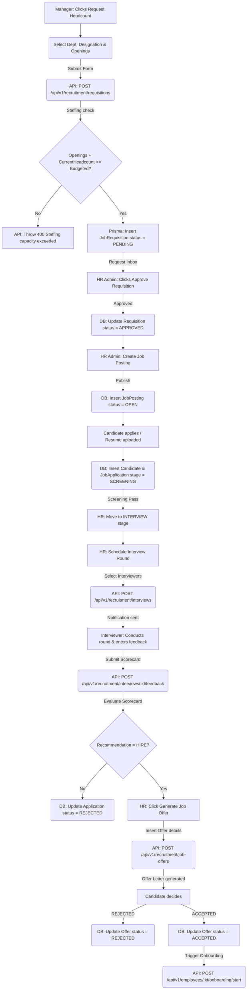

# Module 7 Specs: Recruitment & ATS

This document provides a comprehensive technical reference for the **Recruitment & ATS** module of SKYLINX PeopleOS HRMS, covering database models, backend NestJS controllers, frontend Next.js pages, role permissions, and end-to-end data flows.

---

## 1. Functional Purpose & Business Logic

The Recruitment module manages headcount budgets, job requisitions, candidate flows, multi-round interview scoring, and offer generation:

1.  **Staffing Plans & Budget Validations**:
    *   **StaffingPlan Table**: Holds budgeted headcounts for specific department-designation pairings within a company (`budgetedHeadcount`, `currentHeadcount`).
    *   **Validation Check**: When a manager or HR creates a `JobRequisition`, the system queries the active `StaffingPlan` for the requested `departmentId` and `designationId`. If `requestedOpenings + currentHeadcount > budgetedHeadcount`, the API triggers a `400 Bad Request` staffing capacity exceeded warning or block.
2.  **Application Pipeline Stages**:
    *   Candidates submit resumes, forming a record in `Candidate`.
    *   A `JobApplication` joins the Candidate to a `JobPosting`.
    *   Applications progress through sequential Kanban stages: `SCREENING` $\rightarrow$ `INTERVIEW` $\rightarrow$ `OFFER` $\rightarrow$ `HIRED` / `REJECTED`.
3.  **Interview Loops & Scorecards**:
    *   An application in the `INTERVIEW` stage can have multiple `InterviewRound` records.
    *   Each round schedules specific `Interview` events mapped to employee `Interviewer` profiles.
    *   Interviewers submit their scorecards (`InterviewFeedback`) providing ratings (1-5), comments, and recommendations (`HIRE`, `REJECT`, `HOLD`).
4.  **Job Offers**:
    *   Once a candidate is recommended for hire, HR generates a `JobOffer` with salary details (`offeredCtc`, `joiningDate`) and customizable terms (`OfferTerm` model).
    *   If accepted, it can trigger the **Onboarding & Separation Lifecycle** (Module 8).

### Dropdown Linkages & Connection Completion
*   **Source Fields**: 
    *   **Job Requisition Form**: Collects Department, Designation, and Requestor ID.
    *   **Schedule Interview Form**: Expects selection of Application ID, Interview Round, and Interviewer IDs (sourced from `Employee` directory).
    *   **Create Offer Letter Form**: Pulls Candidate details and active letter templates.
*   **Dropdown Administration**:
    *   Staffing headcounts are defined under the Staffing Plans settings panel (`/recruitment/staffing-plans`), updating the `StaffingPlan` table.
    *   Letter drafts are saved in the Letter Templates panel (`/settings/letters`), updating the `LetterTemplate` table.
    *   Any changes made in these settings are instantly populated in the dropdown menus of the recruitment and ATS screens.

---

## 2. Detailed Schema & Database Mappings

The recruitment module uses the following models in `packages/database/prisma/schema.prisma`:

*   **`StaffingPlan`**:
    *   `id` (String CUID, Primary Key)
    *   `companyId` (String CUID)
    *   `departmentId` (String CUID, Foreign Key to `Department.id`)
    *   `designationId` (String CUID, Foreign Key to `Designation.id`)
    *   `budgetedHeadcount` (Int)
    *   `currentHeadcount` (Int, Default: 0)
    *   *Constraint*: Unique composite index `@@unique([companyId, departmentId, designationId])`
*   **`JobRequisition`**:
    *   `id` (String CUID, Primary Key)
    *   `companyId` (String CUID, Foreign Key to `Company.id`)
    *   `departmentId` (String CUID, Foreign Key to `Department.id`)
    *   `designationId` (String CUID, Foreign Key to `Designation.id`, Optional)
    *   `openings` (Int, Default: 1)
    *   `status` (String, Default: "PENDING")
    *   `requestedById` (String CUID, Foreign Key to `Employee.id`)
    *   `approvedById` (String CUID, Foreign Key to `Employee.id`, Optional)
    *   `reason` (String, Optional)
*   **`JobPosting`**:
    *   `id` (String CUID, Primary Key)
    *   `companyId` (String CUID)
    *   `title` (String)
    *   `departmentId` (String CUID, Optional)
    *   `locationId` (String CUID, Optional)
    *   `openings` (Int, Default: 1)
    *   `status` (String, Default: "OPEN")
    *   `requisitionId` (String CUID, Foreign Key to `JobRequisition.id`, Optional)
*   **`Candidate`**:
    *   `id` (String CUID, Primary Key)
    *   `fullName` (String)
    *   `email` (String)
    *   `phone` (String, Optional)
    *   `resumeUrl` (String, Optional)
    *   `currentStage` (String, Default: "SCREENING")
*   **`JobApplication`**:
    *   `id` (String CUID, Primary Key)
    *   `jobPostingId` (String CUID, Foreign Key to `JobPosting.id`)
    *   `candidateId` (String CUID, Foreign Key to `Candidate.id`)
    *   `stage` (String, Default: "SCREENING")
    *   `status` (String, Default: "ACTIVE")
    *   `assignedRecruiterId` (String CUID, Optional)
*   **`InterviewRound`**:
    *   `id` (String CUID, Primary Key)
    *   `applicationId` (String CUID, Foreign Key to `JobApplication.id`)
    *   `name` (String, e.g. "Technical Round 1")
    *   `roundNumber` (Int, Default: 1)
    *   `status` (String, Default: "PENDING")
*   **`Interview`**:
    *   `id` (String CUID, Primary Key)
    *   `applicationId` (String CUID, Foreign Key to `JobApplication.id`)
    *   `roundId` (String CUID, Foreign Key to `InterviewRound.id`, Optional)
    *   `scheduledAt` (DateTime)
    *   `mode` (String, e.g. "VIDEO")
    *   `status` (String, Default: "SCHEDULED")
*   **`Interviewer`**:
    *   `id` (String CUID, Primary Key)
    *   `interviewId` (String CUID, Foreign Key to `Interview.id`)
    *   `employeeId` (String CUID, Foreign Key to `Employee.id`)
    *   *Constraint*: Unique composite index `@@unique([interviewId, employeeId])`
*   **`InterviewFeedback`**:
    *   `id` (String CUID, Primary Key)
    *   `interviewId` (String CUID, Foreign Key to `Interview.id`)
    *   `interviewerEmployeeId` (String CUID, Foreign Key to `Employee.id`)
    *   `rating` (Int)
    *   `comments` (String, Optional)
    *   `recommendation` (String, e.g. "HIRE")
    *   *Constraint*: Unique composite index `@@unique([interviewId, interviewerEmployeeId])`
*   **`JobOffer`**:
    *   `id` (String CUID, Primary Key)
    *   `applicationId` (String CUID, Foreign Key to `JobApplication.id`)
    *   `offeredCtc` (Decimal)
    *   `joiningDate` (DateTime)
    *   `status` (String, Default: "DRAFT")
    *   `offerLetterUrl` (String, Optional)
*   **`OfferTerm`**:
    *   `id` (String CUID, Primary Key)
    *   `jobOfferId` (String CUID, Foreign Key to `JobOffer.id`)
    *   `title` (String)
    *   `description` (String)

---

## 3. NestJS API Controllers & Services

*   **Folder Location**: `apps/api/src/modules/recruitment`
*   **Controller**: `recruitment.controller.ts`
*   **Endpoints**:
    *   `POST /api/v1/recruitment/requisitions`: Validates request openings against `StaffingPlan` limits. Registers `JobRequisition` in a `PENDING` state.
    *   `PATCH /api/v1/recruitment/requisitions/:id/decide`: Approves/rejects requisition. If approved, increments headcount parameters.
    *   `POST /api/v1/recruitment/job-postings`: Creates active job posting slots.
    *   `POST /api/v1/recruitment/candidates`: Logs candidate contact coordinates and parses resume URLs.
    *   `POST /api/v1/recruitment/applications`: Links candidates to postings.
    *   `POST /api/v1/recruitment/interviews`: Schedules interviews and maps interviewers.
    *   `POST /api/v1/recruitment/interviews/:id/feedback`: Receives interviewer ratings and scorecard comments.
    *   `POST /api/v1/recruitment/job-offers`: Creates formal job offer details.

---

## 4. Next.js UI Screens & Multi-Role View Mappings

*   **Files**:
    *   `apps/web/app/recruitment/page.tsx`
    *   `apps/web/components/recruitment-console.tsx`

### A. HR Admin View
*   **Access Requirements**: Role `HR_ADMIN` or `OWNER` with `recruitment.approve`, `recruitment.create`.
*   **UI Controls**:
    *   `Job Requisitions` list: Review inbox to approve or reject pending manager requests.
    *   `Publish Posting` button: Converts approved requisitions into active job boards.
    *   `Generate Offer` form: Selects candidate, loads template body variables, and prints offers.

### B. Manager View
*   **Access Requirements**: Role `MANAGER` with `recruitment.create`.
*   **UI Controls**:
    *   `Request Headcount` button: Opens requisition form selecting department, target designation, and required headcount openings.
    *   `My Interviews` dashboard: Exposes list of scheduled interviews, with `Submit Feedback Scorecard` buttons.

### C. Employee View
*   **Access Requirements**: Role `EMPLOYEE` with `recruitment.read` (limited scope).
*   **UI Controls**:
    *   `Interviews Assigned` list: Can view interview schedule details.
    *   `Refer Candidate` button: Opens referral uploader.

---

## 5. End-to-End Cycle Flowchart

This flowchart outlines the complete recruitment funnel from staffing constraints checks to onboarding triggers:

