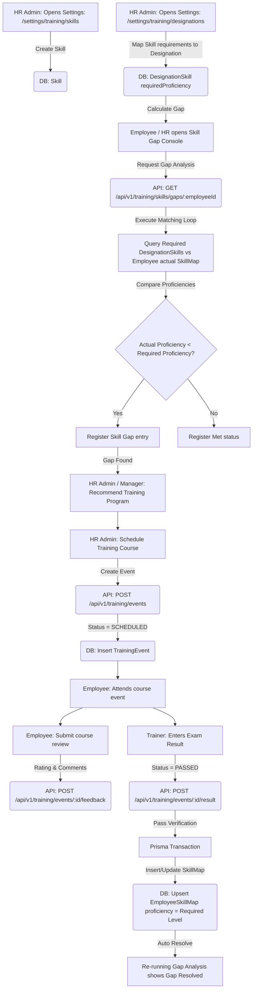

# Module 9 Specs: Training & Skill Assessments

This document provides a comprehensive technical reference for the **Training & Skill Assessments** module of SKYLINX PeopleOS HRMS, covering database models, backend NestJS controllers, frontend Next.js pages, role permissions, and end-to-end data flows.

---

## 1. Functional Purpose & Business Logic

The Training module manages organizational knowledge, maps skills to roles, evaluates competency levels, and identifies training requirements:

1.  **Skills Mapping & Inventory**:
    *   Maintains a global catalog of competency metrics (`Skill`).
    *   **Employee Skills Registry**: Maps actual proficiencies (`EmployeeSkillMap` with levels `BEGINNER`, `INTERMEDIATE`, `EXPERT`) to employees.
2.  **Designation Competency Gates**:
    *   Maps required skill sets and proficiency levels (`DesignationSkill`) to designations.
3.  **Skill Gap Analysis Engine**:
    *   The system evaluates competencies by comparing an employee's required designation skills against their actual skills map.
    *   **Calculation Method**: Mapped using numeric indices: `BEGINNER = 1`, `INTERMEDIATE = 2`, `EXPERT = 3`, `NONE = 0`.
    *   If an employee's actual level is less than the designation's required level, it registers as a **Skill Gap**.
4.  **Training Schedules & Performance tracking**:
    *   Identified gaps route employees into `TrainingProgram` courses.
    *   Courses schedule specific `TrainingEvent` items (recording trainers, locations, and dates).
    *   Upon completion, employees submit course reviews (`TrainingFeedback`) and trainers input exam outcomes (`TrainingResult` with status `PASSED` / `FAILED`). Passing can trigger automatic updates to the employee's `EmployeeSkillMap` proficiency.

### Dropdown Linkages & Connection Completion
*   **Source Fields**: 
    *   **Designation-Skill Map Form**: Selects Designations, Skills, and target proficiencies.
    *   **Schedule Event Form**: Selects active Training Programs.
    *   **Enrollment / Result Forms**: Selects Employees and active scheduled events.
*   **Dropdown Administration**:
    *   Skills lists are configured in the Skills catalog settings page (`/settings/training/skills`), updating the `Skill` table.
    *   Designation requirements (what skills each role must have) are assigned inside the Designation Requirements settings page (`/settings/training/designations`), updating the `DesignationSkill` table.
    *   Any changes made in these settings are instantly populated in the dropdown menus of the training and skill gap consoles.

---

## 2. Detailed Schema & Database Mappings

The training module uses the following models in `packages/database/prisma/schema.prisma`:

*   **`TrainingProgram`**:
    *   `id` (String CUID, Primary Key)
    *   `name` (String)
    *   `description` (String, Optional)
*   **`TrainingEvent`**:
    *   `id` (String CUID, Primary Key)
    *   `programId` (String CUID, Foreign Key to `TrainingProgram.id`)
    *   `eventName` (String)
    *   `trainerName` (String)
    *   `startDate` (DateTime)
    *   `endDate` (DateTime)
    *   `location` (String, Optional)
    *   `status` (String, Default: "SCHEDULED") // SCHEDULED, COMPLETED, CANCELLED
*   **`TrainingFeedback`**:
    *   `id` (String CUID, Primary Key)
    *   `eventId` (String CUID, Foreign Key to `TrainingEvent.id`)
    *   `employeeId` (String CUID, Foreign Key to `Employee.id`)
    *   `rating` (Int)
    *   `comments` (String, Optional)
*   **`TrainingResult`**:
    *   `id` (String CUID, Primary Key)
    *   `eventId` (String CUID, Foreign Key to `TrainingEvent.id`)
    *   `employeeId` (String CUID, Foreign Key to `Employee.id`)
    *   `status` (String) // PASSED, FAILED
    *   `comments` (String, Optional)
*   **`Skill`**:
    *   `id` (String CUID, Primary Key)
    *   `name` (String, Unique)
    *   `description` (String, Optional)
*   **`EmployeeSkillMap`**:
    *   `id` (String CUID, Primary Key)
    *   `employeeId` (String CUID, Foreign Key to `Employee.id`)
    *   `skillId` (String CUID, Foreign Key to `Skill.id`)
    *   `proficiency` (String) // BEGINNER, INTERMEDIATE, EXPERT
    *   *Constraint*: Unique composite index `@@unique([employeeId, skillId])`
*   **`DesignationSkill`**:
    *   `id` (String CUID, Primary Key)
    *   `designationId` (String CUID, Foreign Key to `Designation.id`)
    *   `skillId` (String CUID, Foreign Key to `Skill.id`)
    *   `requiredProficiency` (String) // BEGINNER, INTERMEDIATE, EXPERT
    *   *Constraint*: Unique composite index `@@unique([designationId, skillId])`

---

## 3. NestJS API Controllers & Services

*   **Folder Location**: `apps/api/src/modules/training`
*   **Controller**: `training.controller.ts`
*   **Endpoints**:
    *   `POST /api/v1/training/programs`: Creates courses.
    *   `POST /api/v1/training/events`: Schedules classes.
    *   `POST /api/v1/training/events/:id/feedback`: Receives class reviews.
    *   `POST /api/v1/training/events/:id/result`: Logs exam grades.
    *   `POST /api/v1/training/skills`: Creates skills entries.
    *   `POST /api/v1/training/skills/assess`: Assesses skill records (creates or updates `EmployeeSkillMap`).
    *   `POST /api/v1/training/designations/skills`: Maps requirements to designations.
    *   `GET /api/v1/training/skills/gaps/:employeeId`: Evaluates and returns gap analyses.

---

## 4. Next.js UI Screens & Multi-Role View Mappings

*   **Files**:
    *   `apps/web/app/training/page.tsx`
    *   `apps/web/components/training-console.tsx`

### A. HR Admin View
*   **Access Requirements**: Role `HR_ADMIN` or `OWNER` with `training.create`, `training.configure`.
*   **UI Controls**:
    *   `Create Program` & `Schedule Event` buttons: Opens scheduling panels.
    *   `Map Designation Skills` forms: Matches required skills to job designations.
    *   `Log Training Results` button next to course attendee tables.
*   **Readouts**: Full company skill gaps dashboard indicating department discrepancies.

### B. Manager View
*   **Access Requirements**: Role `MANAGER` with `training.read`.
*   **UI Controls**:
    *   Can view training schedules and course catalogs.
    *   Sees the skill gaps dashboard for direct department subordinates. Can recommend courses.

### C. Employee View
*   **Access Requirements**: Role `EMPLOYEE` with self-scope permissions.
*   **UI Controls**:
    *   `Self Gap Analysis` tab: Displays required skills for their designation vs their current assessed proficiencies.
    *   `My Enrolled Events` list: Reviews schedule details.
    *   `Submit Feedback` button next to completed class items.

---

## 5. End-to-End Cycle Flowchart

This flowchart outlines the complete skills assessment, gaps calculation, training execution, and competency updates:

