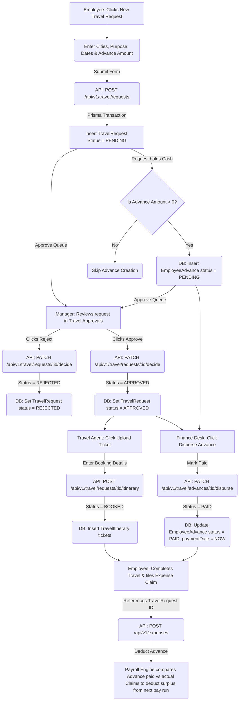

# Module 10 Specs: Travel Desk

This document provides a comprehensive technical reference for the **Travel Desk** module of SKYLINX PeopleOS HRMS, covering database models, backend NestJS controllers, frontend Next.js pages, role permissions, and end-to-end data flows.

---

## 1. Functional Purpose & Business Logic

The Travel Desk module facilitates business travel bookings, tracks cash advances, maintains itineraries, and resolves travel expense claims:

1.  **Travel Requests**:
    *   Employees initiate requests specifying the purpose, source, destination, estimated costs, travel dates, and requested cash advance (`TravelRequest` model).
    *   Requests enter a `PENDING` state, routing to the manager.
2.  **Cash Advances**:
    *   If a travel request requests an advance, it triggers the automatic insertion of an `EmployeeAdvance` record.
    *   Once the travel request is approved, the Finance Team / HR Admin disbursements system marks the advance status as `PAID`.
3.  **Itinerary Booking**:
    *   Travel desk agents or HR Admins upload travel tickets, boarding details, or hotel booking summaries (`TravelItinerary` model with `modeOfTravel` categories like `FLIGHT`, `TRAIN`, `CAB`, `HOTEL`).
4.  **Expense Settle-Up**:
    *   Post-travel, the employee uploads receipts via **Expense Claims** (Module 6) referencing the travel request ID. 
    *   The payroll calculation engine accounts for outstanding cash advances against reimbursed expenses to adjust monthly payouts.

### Dropdown Linkages & Connection Completion
*   **Source Fields**: 
    *   **Travel Request Form**: Selecting source and destination cities pulls locations dynamically from the office branches list (`/api/v1/organization/locations`).
    *   **Itinerary Form**: Dropdown menus configure booking modes (Flight, Hotel, etc.).
*   **Dropdown Administration**:
    *   Locations and offices are defined under the Location Settings page (`/settings/organization/locations`), updating the `Location` table.
    *   Travel policies and maximum allowance categories per grade are linked to Grade variables inside Policy Settings (`/settings/policies/grades`), matching `maxExpenseLimit` constraints.
    *   Any changes made in these settings are instantly populated in the dropdown menus of the travel request consoles.

---

## 2. Detailed Schema & Database Mappings

The travel module uses the following models in `packages/database/prisma/schema.prisma`:

*   **`TravelRequest`**:
    *   `id` (String CUID, Primary Key)
    *   `employeeId` (String CUID, Foreign Key to `Employee.id`)
    *   `purpose` (String)
    *   `startDate` (DateTime)
    *   `endDate` (DateTime)
    *   `sourceCity` (String)
    *   `destinationCity` (String)
    *   `estimatedCost` (Decimal, Default: 0)
    *   `advanceAmount` (Decimal, Default: 0)
    *   `status` (Enum: `PENDING`, `APPROVED`, `REJECTED`)
*   **`TravelItinerary`**:
    *   `id` (String CUID, Primary Key)
    *   `requestId` (String CUID, Foreign Key to `TravelRequest.id`)
    *   `modeOfTravel` (String, e.g. "FLIGHT", "HOTEL")
    *   `ticketNumber` (String, Optional)
    *   `boardingAt` (DateTime, Optional)
    *   `details` (String, Optional)
*   **`EmployeeAdvance`**:
    *   `id` (String CUID, Primary Key)
    *   `employeeId` (String CUID, Foreign Key to `Employee.id`)
    *   `requestId` (String CUID, Foreign Key to `TravelRequest.id`, Optional)
    *   `amount` (Decimal)
    *   `status` (String, Default: "PENDING") // PENDING, PAID, RECOVERED
    *   `paymentDate` (DateTime, Optional)

---

## 3. NestJS API Controllers & Services

*   **Folder Location**: `apps/api/src/modules/travel`
*   **Controller**: `travel.controller.ts`
*   **Endpoints**:
    *   `POST /api/v1/travel/requests`: Creates travel logs. If `advanceAmount > 0`, inserts an `EmployeeAdvance` linked to the request.
    *   `PATCH /api/v1/travel/requests/:id/decide`: Manager approves or rejects the travel request.
    *   `POST /api/v1/travel/requests/:id/itinerary`: HR Admins append travel tickets and hotel bookings.
    *   `PATCH /api/v1/travel/advances/:id/disburse`: Finance team marks cash advance as `PAID` and sets `paymentDate`.

---

## 4. Next.js UI Screens & Multi-Role View Mappings

*   **Files**:
    *   `apps/web/app/travel/page.tsx`
    *   `apps/web/components/travel-console.tsx`

### A. HR Admin / Travel Agent View
*   **Access Requirements**: Role `HR_ADMIN`, `OWNER` or `TRAVEL_AGENT` with `travel.update`, `travel.approve`.
*   **UI Controls**:
    *   `Active Bookings` console: Displays approved requests awaiting booking.
    *   `Upload Ticket` button: Opens itinerary setup forms.
    *   `Disburse Advance` button in the Advances dashboard table.

### B. Manager View
*   **Access Requirements**: Role `MANAGER` with `travel.approve`.
*   **UI Controls**:
    *   `Travel Approvals` inbox: Shows subordinate requests.
    *   `Approve` & `Reject` buttons next to request logs.

### C. Employee View
*   **Access Requirements**: Role `EMPLOYEE` with self-scope permissions.
*   **UI Controls**:
    *   `New Travel Request` button: Opens application form selecting dates, cities, and cash advance requirements.
    *   `My Trips` list: Displays ticket download links once uploaded by the travel desk.

---

## 5. End-to-End Cycle Flowchart

This flowchart outlines the complete travel request, cash advance disbursement, ticket booking, and expense claim cycle:

