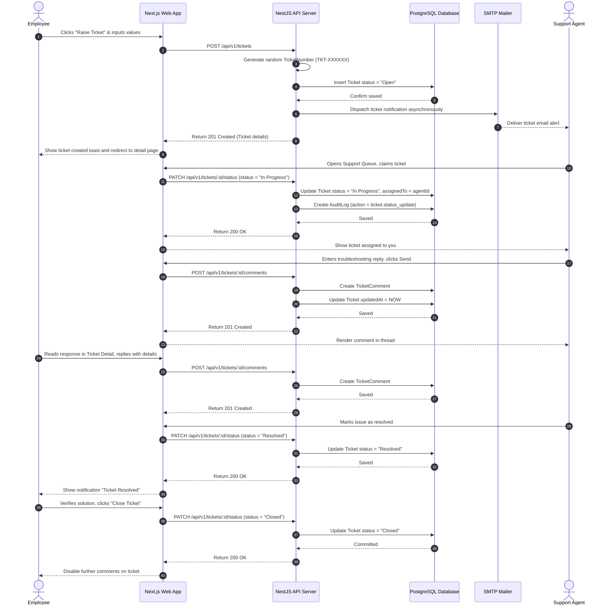

# Module 12 Specs: Support Helpdesk

This document provides a comprehensive technical reference for the **Support Helpdesk** module of SKYLINX PeopleOS HRMS, covering database models, backend NestJS controllers, frontend Next.js pages, role permissions, and end-to-end data flows.

---

## 1. Functional Purpose & Business Logic

The Support Helpdesk module aggregates internal employee queries, routing them into structured service queues, managing communication threads, and validating resolutions:

1.  **Ticket Creation & Routing**:
    *   Employees submit issues specifying a subject, description, priority (`Low`, `Medium`, `High`, `Critical`), and target category queue (`HR Helpdesk`, `IT Helpdesk`, `Finance Desk`).
    *   A random identifier is generated (`TKT-` + 6-digit number) and logged (`Ticket` model).
2.  **Automated Notifications**:
    *   Creating a ticket triggers an asynchronous email notification to the corresponding queue handlers (e.g. IT support admins for IT tickets) summarizing ticket details.
3.  **Communication Threading**:
    *   Enables bidirectional messaging via the `TicketComment` table. Updates to comments flag the parent ticket's `updatedAt` field.
4.  **Status SLA Tracking**:
    *   Tickets transition through statuses: `Open` $\rightarrow$ `In Progress` $\rightarrow$ `Resolved` $\rightarrow$ `Closed`.
    *   Audits log status transitions (`AuditLog` with `action = ticket.status_update`), enabling response time reports.

### Dropdown Linkages & Connection Completion
*   **Source Fields**: 
    *   **New Ticket Form**: Dropdown selection of Priority (Low, Medium, High, Critical) and Queue (HR Helpdesk, IT Helpdesk, Finance Desk).
    *   **Assign Agent Form**: Dropdown selection of Helpdesk Agent (sourced from active directory filter matching employees assigned to Support roles).
*   **Dropdown Administration**:
    *   Support Queues and assigned agents are configured under the Helpdesk settings panel (`/settings/helpdesk`), updating support queue mappings in company rules.
    *   Any changes made in these settings are instantly populated in the dropdown menus of the helpdesk console.

---

## 2. Detailed Schema & Database Mappings

The helpdesk module uses the following models in `packages/database/prisma/schema.prisma`:

*   **`Ticket`**:
    *   `id` (String CUID, Primary Key)
    *   `tenantId` (String CUID, Foreign Key to `Company.id`)
    *   `ticketNumber` (String, Unique)
    *   `subject` (String)
    *   `description` (String)
    *   `queue` (String, Default: "HR Helpdesk")
    *   `priority` (String, Default: "Medium") // Low, Medium, High, Critical
    *   `status` (String, Default: "Open") // Open, In Progress, Resolved, Closed
    *   `assignedTo` (String CUID, Optional) // Foreign Key to Employee.id
    *   `createdAt` (DateTime, Default: now)
    *   `updatedAt` (DateTime, Updated on comment/status change)
*   **`TicketComment`**:
    *   `id` (String CUID, Primary Key)
    *   `ticketId` (String CUID, Foreign Key to `Ticket.id`)
    *   `userId` (String CUID, Foreign Key to `User.id`)
    *   `comment` (String)
    *   `createdAt` (DateTime, Default: now)

---

## 3. NestJS API Controllers & Services

*   **Folder Location**: `apps/api/src/modules/tickets`
*   **Controller**: `tickets.controller.ts`
*   **Endpoints**:
    *   `POST /api/v1/tickets`: Accepts ticket payload, creates a unique ticket number, registers `Ticket` model, and dispatches SMTP alerts.
    *   `GET /api/v1/tickets`: Returns the company's tickets list (filtered by tenant context).
    *   `GET /api/v1/tickets/:id`: Retrieves ticket details including complete comment histories.
    *   `POST /api/v1/tickets/:id/comments`: Adds messages to the comment thread.
    *   `PATCH /api/v1/tickets/:id/status`: Updates ticket status (logs audit events).

---

## 4. Next.js UI Screens & Multi-Role View Mappings

*   **Files**:
    *   `apps/web/app/tickets/page.tsx`
    *   `apps/web/components/tickets-console.tsx`

### A. Support Agent View
*   **Access Requirements**: Role `SUPPORT_AGENT` or `HR_ADMIN` with ticket management permissions.
*   **UI Controls**:
    *   `Tickets Queue` dashboard: View tickets filtered by category queues.
    *   `Claim Ticket` button: Assigns ticket to self.
    *   `Update Status` dropdown: Changes status to `In Progress` or `Resolved`.
    *   `Reply` comment editor: Logs updates to communication threads.

### B. Employee View
*   **Access Requirements**: Role `EMPLOYEE` with self-scope permissions.
*   **UI Controls**:
    *   `Raise Ticket` button: Opens ticket creation modal with subject, description, priority, and queue options.
    *   `My Tickets` list: Displays status and comments of own tickets.
    *   `Close Ticket` button: Marks ticket status as `Closed` once resolved.
    *   `Add Comment` editor: Interacts with support agents in real-time.

---

## 5. End-to-End Cycle Flowchart

This flowchart outlines the complete support ticket creation, routing, resolution, and closure cycle:

